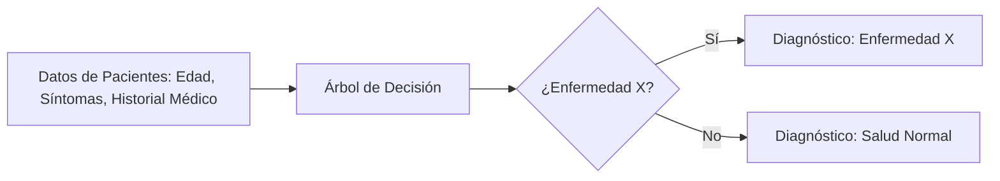
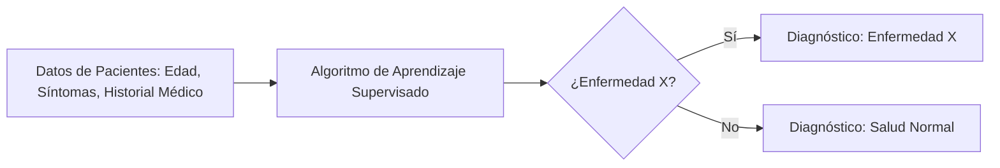

El **aprendizaje supervisado** es una de las técnicas más utilizadas en el aprendizaje automático (machine learning). Este enfoque se basa en entrenar un modelo utilizando un conjunto de datos que ya contiene las respuestas correctas, es decir, **datos etiquetados**. A través de estos datos, el modelo aprende a predecir o clasificar datos nuevos. En este post, exploraremos qué son los algoritmos de aprendizaje supervisado, cómo funcionan, ejemplos de algoritmos y aplicaciones prácticas, junto con diagramas explicativos.

### 1. ¿Qué Son los Algoritmos de Aprendizaje Supervisado?

El aprendizaje supervisado se basa en **algoritmos que aprenden de ejemplos etiquetados**. Estos algoritmos procesan datos de entrada (características) junto con sus correspondientes salidas o etiquetas (resultados correctos). Durante el entrenamiento, el modelo ajusta sus parámetros para minimizar el error entre sus predicciones y las respuestas correctas.

Los algoritmos de aprendizaje supervisado pueden abordar dos tipos principales de problemas:
- **Clasificación**: El objetivo es asignar una etiqueta discreta a una entrada. Ejemplo: determinar si un correo es **spam** o **no spam**.
- **Regresión**: El objetivo es predecir un valor numérico continuo. Ejemplo: estimar el **precio de una casa** basado en sus características.

### 2. Principales Algoritmos de Aprendizaje Supervisado

#### 2.1. **K-Nearest Neighbors (KNN)**

El **algoritmo K-Nearest Neighbors (KNN)** es uno de los más sencillos y populares en tareas de clasificación. KNN clasifica una nueva entrada según la mayoría de las clases de sus *k* vecinos más cercanos en el espacio de características. No requiere entrenamiento previo, solo necesita calcular las distancias entre los puntos de datos.

**Diagrama - Clasificación con KNN:**

**Explicación**:
- El algoritmo recibe un conjunto de datos de entrada (características del correo electrónico, como contenido y encabezado).
- Luego, calcula las distancias entre el nuevo correo y los correos etiquetados en los datos de entrenamiento.
- Según la mayoría de las etiquetas de los *k* vecinos más cercanos, predice si el correo es **spam** o **no spam**.

#### 2.2. **Regresión Lineal**

La **regresión lineal** es un algoritmo de aprendizaje supervisado utilizado para predecir un valor numérico continuo. Busca una relación lineal entre las características de entrada y la variable de salida. Es ampliamente utilizado en problemas de regresión.

**Diagrama - Regresión Lineal:**

**Explicación**:
- En este ejemplo, la regresión lineal se usa para predecir el precio de una casa.
- El algoritmo encuentra una línea que ajusta los datos de entrenamiento (características de las casas y sus precios) de manera que minimiza el error.
- Una vez entrenado, puede predecir el precio de una casa nueva en función de sus características.

#### 2.3. **Árbol de Decisión**

El **árbol de decisión** es un modelo predictivo basado en un conjunto de reglas de decisión. Es una herramienta poderosa para clasificación y regresión. Los árboles de decisión dividen el espacio de características en segmentos, tomando decisiones basadas en las condiciones de las características.

**Diagrama - Árbol de Decisión para Diagnóstico Médico:**

**Explicación**:
- El árbol de decisión divide los datos de pacientes en función de sus características.
- El modelo toma decisiones (por ejemplo, si el paciente tiene ciertos síntomas) en cada nodo del árbol.
- El resultado final es un diagnóstico (enfermedad X o salud normal).

### 3. Casos de Uso Prácticos de los Algoritmos de Aprendizaje Supervisado

#### 3.1. **Diagnóstico Médico**

Los algoritmos de aprendizaje supervisado se aplican ampliamente en el diagnóstico médico. Utilizando datos etiquetados (por ejemplo, historial médico y resultados de pruebas), los algoritmos pueden predecir enfermedades específicas basándose en los síntomas y características del paciente.

**Diagrama - Diagnóstico Médico:**

**Explicación**:
- Los datos de pacientes se utilizan para entrenar un modelo supervisado que pueda diagnosticar si un paciente tiene una enfermedad X.
- El modelo toma como entrada los datos de un paciente y predice el diagnóstico correcto.

#### 3.2. **Reconocimiento de Imágenes**

En visión por computadora, el aprendizaje supervisado es clave para el reconocimiento de imágenes. Los modelos entrenados con imágenes etiquetadas (por ejemplo, imágenes de gatos y perros) pueden clasificar imágenes no vistas en categorías específicas.

**Diagrama - Clasificación de Imágenes:**

**Explicación**:
- El modelo recibe una imagen como entrada y, después de haber sido entrenado con ejemplos de imágenes etiquetadas, predice si la imagen es un **gato** o un **perro**.

#### 3.3. **Predicción de Precios Inmobiliarios**

Los algoritmos de regresión supervisada, como la regresión lineal, son ideales para predecir precios en mercados inmobiliarios. A partir de datos de propiedades previas (como tamaño, ubicación y número de habitaciones), los algoritmos pueden predecir el precio de nuevas propiedades.

**Diagrama - Predicción de Precios:**

**Explicación**:
- El modelo de regresión lineal toma las características de una propiedad (por ejemplo, tamaño y ubicación) para predecir su precio de mercado basado en datos históricos.

### 4. Conclusión

El aprendizaje supervisado sigue siendo uno de los enfoques más utilizados en el campo del aprendizaje automático. Con algoritmos poderosos como **KNN**, **regresión lineal** y **árboles de decisión**, podemos resolver una variedad de problemas, desde clasificación hasta predicción de valores numéricos continuos. Estos algoritmos son fundamentales en áreas como el diagnóstico médico, la clasificación de imágenes y la predicción de precios, entre otros.

Los casos de uso demostrados muestran cómo los algoritmos supervisados pueden aplicarse a problemas reales, permitiendo a las máquinas aprender de datos históricos y hacer predicciones precisas en contextos complejos.
