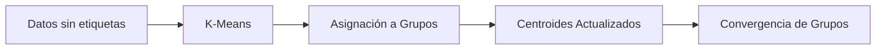
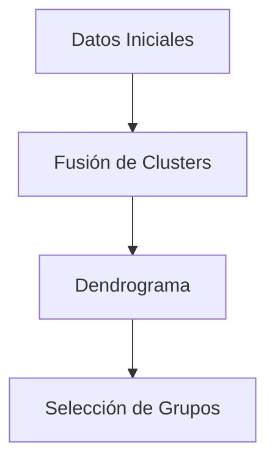
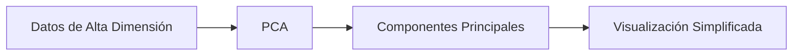
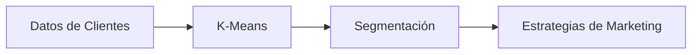
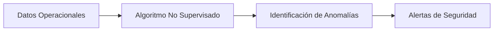
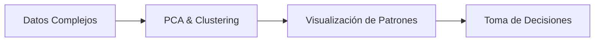

El **aprendizaje no supervisado** es una técnica fundamental en el campo del aprendizaje automático que se emplea cuando los datos no están etiquetados. En este enfoque, los algoritmos detectan patrones, estructuras o relaciones inherentes en los datos sin contar con respuestas predefinidas. En este post, exploraremos qué son los algoritmos de aprendizaje no supervisado, cómo funcionan, ejemplos de algoritmos y aplicaciones prácticas, acompañados de diagramas explicativos.

### 1. ¿Qué es el Aprendizaje No Supervisado?

El aprendizaje no supervisado se centra en analizar conjuntos de datos sin etiquetas para descubrir agrupamientos o relaciones internas. Esto permite:
- **Agrupamiento (Clustering):** Organizar datos en grupos basados en similitudes.  
- **Reducción de Dimensionalidad:** Simplificar la representación de datos manteniendo sus características esenciales.  
- **Detección de Patrones y Anomalías:** Identificar tendencias ocultas o comportamientos atípicos en la información.

### 2. Principales Algoritmos de Aprendizaje No Supervisado

#### 2.1. **K-Means Clustering**

El algoritmo **K-Means** es uno de los métodos más conocidos para el agrupamiento. Divide los datos en *k* grupos, asignando cada punto al centroide más cercano. El proceso se repite hasta que las posiciones de los centroides convergen.

**Diagrama - Agrupamiento con K-Means:**

**Explicación:**
- Se definen *k* centros iniciales.
- Cada dato se asigna al centroide más cercano.
- Se recalculan los centroides según los datos asignados.
- El proceso se repite hasta estabilizar los grupos.

#### 2.2. **Clustering Jerárquico**

El **clustering jerárquico** construye una estructura en forma de árbol (dendrograma) para representar relaciones entre los datos. Puede ser **aglomerativo** (comienza con cada dato como un cluster individual y los fusiona) o **divisivo** (parte de un solo cluster y lo divide).

**Diagrama - Clustering Jerárquico:**

**Explicación:**
- Se calculan las similitudes entre todos los puntos.
- Se fusionan los puntos o clusters más similares.
- Se obtiene un dendrograma que facilita la visualización de la estructura de los datos.

#### 2.3. **Reducción de Dimensionalidad (PCA)**

El **Análisis de Componentes Principales (PCA)** es una técnica para reducir la cantidad de variables conservando la mayor varianza posible. Es útil para visualizar datos complejos y mejorar el rendimiento de otros algoritmos.

**Diagrama - Reducción de Dimensionalidad con PCA:**

**Explicación:**
- PCA transforma los datos originales a un nuevo espacio de menor dimensión.
- Se identifican las direcciones (componentes) con mayor varianza.
- Los datos se proyectan en este espacio, facilitando su análisis.

### 3. Casos de Uso Prácticos de los Algoritmos de Aprendizaje No Supervisado

#### 3.1. **Segmentación de Clientes**

Utilizando técnicas de clustering como K-Means, es posible segmentar a los clientes según comportamientos y características de compra, permitiendo estrategias de marketing personalizadas.

**Diagrama - Segmentación de Clientes:**

#### 3.2. **Detección de Anomalías**

Los algoritmos no supervisados pueden identificar comportamientos atípicos en transacciones financieras o sistemas de seguridad, ayudando a detectar fraudes o fallos.

**Diagrama - Detección de Anomalías:**

#### 3.3. **Análisis Exploratorio de Datos**

Mediante PCA y clustering, es posible analizar grandes volúmenes de datos para descubrir patrones subyacentes, facilitando la toma de decisiones en áreas como la investigación de mercado o la biología.

**Diagrama - Análisis Exploratorio:**

### 4. Conclusión

El aprendizaje no supervisado ofrece herramientas poderosas para explorar y comprender conjuntos de datos sin etiquetas. Con técnicas como **K-Means**, **clustering jerárquico** y **PCA**, es posible descubrir estructuras ocultas, segmentar información y detectar anomalías, lo que resulta esencial en aplicaciones como marketing, seguridad y análisis de datos complejos.
