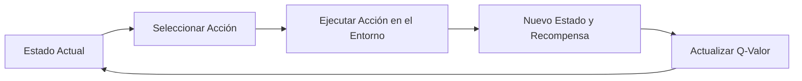
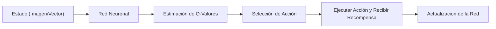
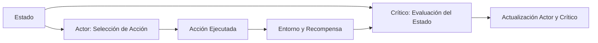
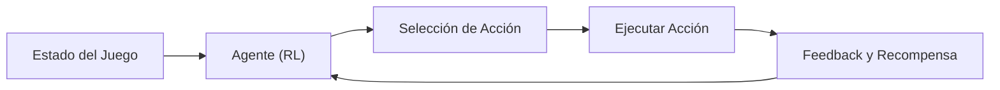
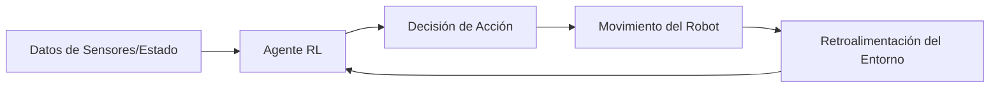

El **aprendizaje por refuerzo** es un paradigma del aprendizaje automático en el que un agente interactúa con su entorno para aprender a tomar decisiones que maximicen una recompensa acumulada. En este post, exploraremos qué son los algoritmos de aprendizaje por refuerzo, cómo funcionan, ejemplos de algoritmos y aplicaciones prácticas, acompañados de diagramas explicativos.

### 1. ¿Qué es el Aprendizaje por Refuerzo?

A diferencia del aprendizaje supervisado, en el aprendizaje por refuerzo el agente no dispone de datos etiquetados previamente, sino que aprende a través de la **interacción** con el entorno. Este proceso se basa en:
- **Estados:** Representan la situación actual del entorno.
- **Acciones:** Opciones que el agente puede ejecutar.
- **Recompensas:** Feedback recibido tras ejecutar una acción.
- **Política:** Estrategia que define qué acción tomar en cada estado.

El objetivo es aprender una política que maximice la recompensa total acumulada a lo largo del tiempo.

### 2. Principales Algoritmos de Aprendizaje por Refuerzo

#### 2.1. **Q-Learning**

El **Q-Learning** es un algoritmo basado en valores que aprende una función Q, la cual estima la utilidad de realizar una acción en un estado determinado. Utilizando una tabla (Q-table), el agente actualiza iterativamente sus estimaciones para acercarse a la acción óptima.

**Diagrama - Ciclo de Q-Learning:**

**Explicación**:
- Se evalúa el estado actual y se selecciona una acción.
- Tras ejecutar la acción, el entorno devuelve un nuevo estado y una recompensa.
- La Q-table se actualiza para reflejar la nueva información.

#### 2.2. **Deep Q-Network (DQN)**

El **DQN** extiende el Q-Learning al utilizar redes neuronales para aproximar la función Q, lo que permite trabajar con espacios de estados de alta dimensión (por ejemplo, imágenes en videojuegos).

**Diagrama - Proceso de DQN:**

**Explicación**:
- El estado se procesa mediante una red neuronal que estima los Q-valores para cada acción.
- Se selecciona la acción con mayor valor y, tras ejecutarla, se utiliza el feedback para ajustar la red.

#### 2.3. **Métodos Actor-Critic**

Los algoritmos **Actor-Critic** combinan métodos basados en políticas (actor) y en valores (crítico). El actor decide qué acción ejecutar, mientras que el crítico evalúa la acción y proporciona feedback para mejorar la política.

**Diagrama - Arquitectura Actor-Critic:**

**Explicación**:
- El actor determina la acción a tomar basándose en el estado.
- El crítico evalúa la calidad de dicha acción, lo que permite ajustar tanto la política como la función de valor.

### 3. Casos de Uso Prácticos

#### 3.1. **Control en Videojuegos y Simulaciones**

El aprendizaje por refuerzo se ha aplicado en videojuegos, donde los agentes aprenden a maximizar la puntuación o completar objetivos mediante la experimentación en entornos simulados.

**Diagrama - Agente en Videojuego:**

#### 3.2. **Robótica y Control Autónomo**

En la robótica, los algoritmos de aprendizaje por refuerzo permiten que los robots aprendan tareas complejas (como la navegación o manipulación de objetos) mediante la interacción continua con su entorno.

**Diagrama - Robótica con RL:**

**Explicación**:
- Los robots recogen información a través de sensores y determinan sus acciones.
- La retroalimentación del entorno se utiliza para mejorar continuamente la estrategia del agente.

### 4. Conclusión

El aprendizaje por refuerzo es una técnica poderosa para resolver problemas de toma de decisiones en entornos dinámicos y complejos. Con algoritmos como **Q-Learning**, **DQN** y **Actor-Critic**, se pueden desarrollar sistemas que aprenden de la experiencia y se adaptan a nuevas situaciones, abriendo un amplio abanico de aplicaciones en videojuegos, robótica, optimización de procesos y más.
