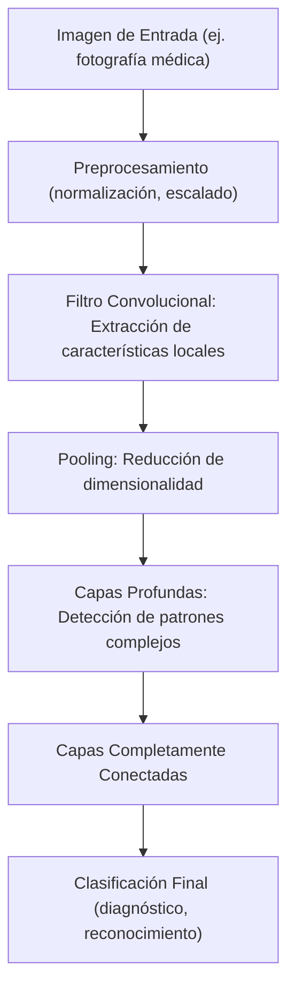
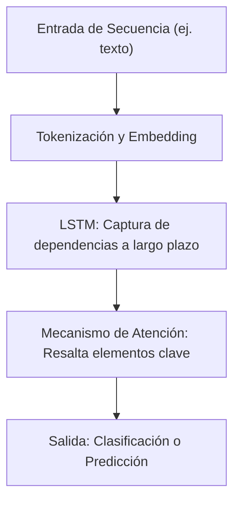
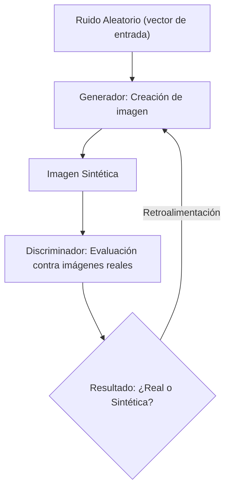
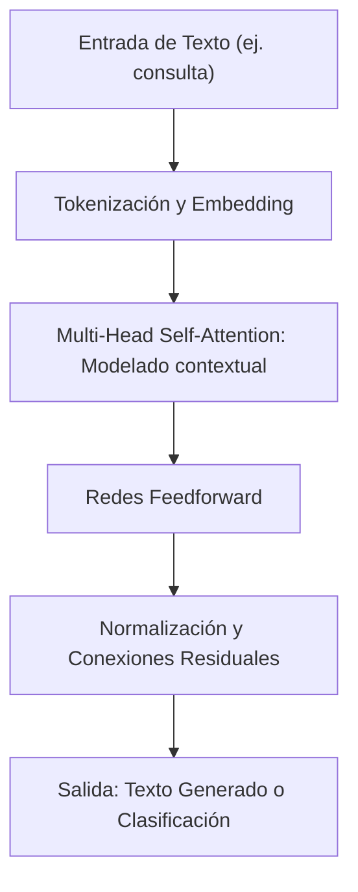
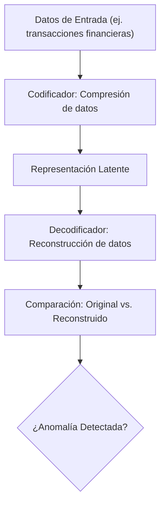

El avance de la inteligencia artificial se ha impulsado con el desarrollo de algoritmos basados en redes neuronales, capaces de aprender representaciones complejas a partir de datos. En este post se abordan los fundamentos, principales arquitecturas y aplicaciones prácticas de estos algoritmos.

---

## 1. ¿Qué son los Algoritmos de Redes Neuronales?

Se trata de modelos computacionales inspirados en el cerebro humano que aprenden a partir de datos. Estos algoritmos transforman la información a través de capas de neuronas artificiales, permitiendo:

- **Extracción de patrones complejos:** Mediante representaciones jerárquicas.
- **Optimización iterativa:** Ajuste de millones de parámetros mediante técnicas como el descenso del gradiente.
- **Uso de hardware especializado:** Aprovechamiento de GPUs/TPUs para acelerar el entrenamiento.

---

## 2. Principales Arquitecturas y Algoritmos

### 2.1. Algoritmos Basados en Convoluciones (CNN)

Las **Redes Neuronales Convolucionales** se emplean principalmente en el análisis de imágenes y vídeos, extrayendo características locales que se combinan para formar una representación global.

**Diagrama - Clasificación de Imágenes con CNN:**

**Aplicaciones:** Diagnóstico médico, reconocimiento facial, análisis satelital.

---

### 2.2. Algoritmos Basados en Secuencias: RNN, LSTM y GRU

Diseñados para datos secuenciales (texto, series temporales), estos algoritmos capturan dependencias a corto y largo plazo. Las variantes LSTM y GRU introducen mecanismos de memoria para mejorar el aprendizaje.

**Diagrama - Procesamiento de Secuencias con LSTM:**

**Aplicaciones:** Procesamiento del lenguaje natural, análisis de sentimientos, predicción de series temporales.

---

### 2.3. Algoritmos Generativos: GANs

Las **Redes Generativas Antagónicas** trabajan mediante la interacción de dos modelos: un generador que crea datos sintéticos y un discriminador que evalúa su autenticidad, en un proceso competitivo.

**Diagrama - Generación de Imágenes con GAN:**

**Aplicaciones:** Creación de deepfakes, arte digital, simulación de datos.

---

### 2.4. Algoritmos Basados en Atención: Transformers

Los **Transformers** han revolucionado el procesamiento del lenguaje gracias a su capacidad para modelar relaciones contextuales de manera paralela, superando las limitaciones de las RNN.

**Diagrama - Arquitectura Transformer:**

**Aplicaciones:** Chatbots, asistentes virtuales, traducción automática, resumen de textos.

---

### 2.5. Algoritmos de Compresión y Reducción de Dimensionalidad: Autoencoders

Los **Autoencoders** realizan una compresión de datos a través de una arquitectura codificador-decodificador, facilitando la detección de anomalías o la reducción de dimensionalidad.

**Diagrama - Autoencoder para Detección de Anomalías:**

**Aplicaciones:** Detección de fraude, monitorización industrial, análisis de patrones de consumo.

---

## 3. Aplicaciones Prácticas en Diversos Sectores

- **Visión por Computadora:** Implementación en automóviles autónomos, diagnóstico médico y análisis de imágenes satelitales.
- **Procesamiento de Lenguaje Natural:** Generación de texto, traducción automática y chatbots.
- **Finanzas y Seguridad:** Predicción de mercados, detección de fraude y análisis de comportamientos anómalos.
- **Entretenimiento y Arte Digital:** Creación de imágenes, videos y música a partir de modelos generativos.

---

## 4. Desafíos y Tendencias Futuras

- **Interpretabilidad:** Se sigue trabajando para desentrañar la "caja negra" de los modelos y hacerlos más transparentes.
- **Optimización y Escalabilidad:** Innovación en algoritmos de optimización y uso de hardware especializado para entrenar modelos cada vez más complejos.
- **Aprendizaje Auto-Supervisado:** Reducción de la dependencia de datos etiquetados mediante el uso de grandes volúmenes de datos sin supervisión.
- **Ética y Seguridad:** Enfrentar los retos éticos asociados al uso de modelos generativos, como la creación de deepfakes y la manipulación de información.

---

## 5. Conclusión

Los algoritmos de redes neuronales son la base del aprendizaje profundo, permitiendo resolver problemas complejos en múltiples áreas. Con arquitecturas como CNN, RNN, GAN, Transformers y Autoencoders, la inteligencia artificial continúa evolucionando y abriendo nuevas oportunidades tecnológicas, a la vez que enfrenta desafíos críticos en interpretabilidad, escalabilidad y ética.

Este post brinda una visión técnica y actualizada de cómo estos algoritmos están transformando la forma en que procesamos y analizamos datos, impulsando la innovación en un mundo cada vez más digital.
