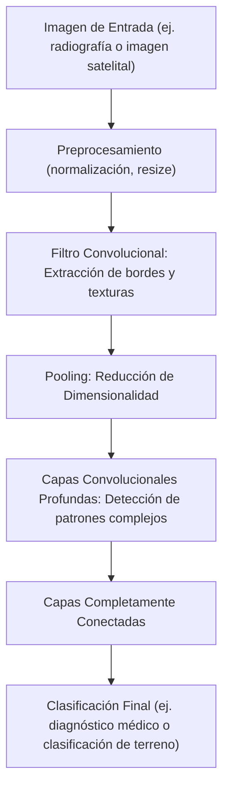
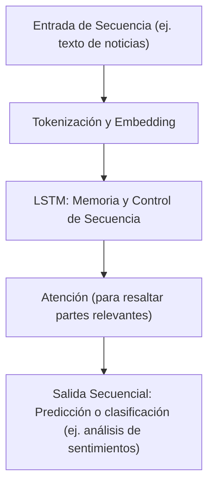
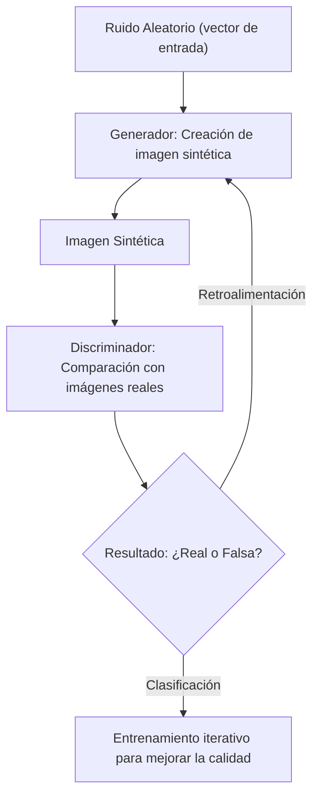
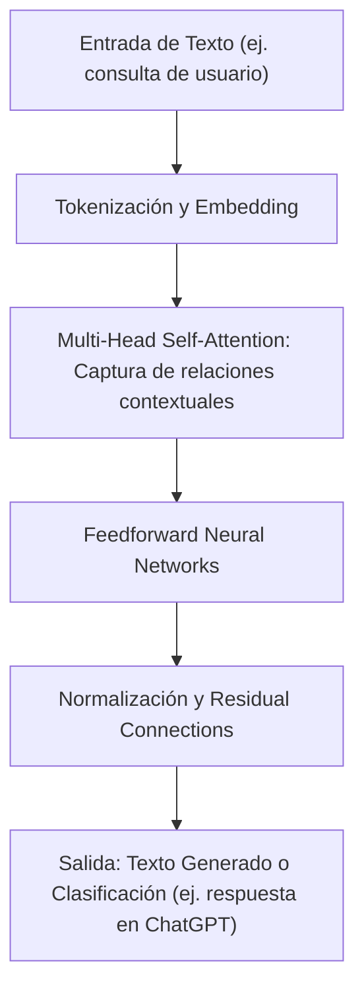
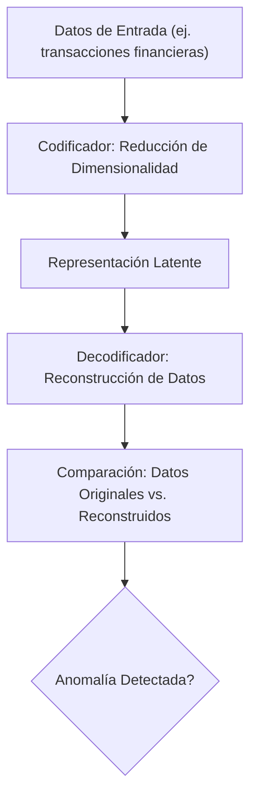

El **aprendizaje profundo** ha evolucionado para abordar desafíos complejos mediante la utilización de **redes neuronales profundas** que aprenden representaciones jerárquicas de los datos. Actualmente, se aplican en diversas áreas que van desde el análisis de imágenes médicas hasta la generación de contenido y sistemas de lenguaje natural de última generación.

---

## 1. ¿Qué es el Aprendizaje Profundo?

El aprendizaje profundo se basa en arquitecturas con múltiples capas, donde cada nivel transforma y abstrae la información, permitiendo detectar patrones complejos. Entre los requerimientos principales se encuentran:

- **Grandes volúmenes de datos**: Cruciales para entrenar modelos de alta capacidad.
- **Recursos computacionales avanzados**: Uso de GPU/TPU para acelerar el entrenamiento.
- **Técnicas de optimización y regularización**: Fundamental para ajustar millones de parámetros sin sobreajuste.

---

## 2. Principales Arquitecturas y Ejemplos Actuales

### 2.1. **Redes Neuronales Convolucionales (CNN)**

Las **CNN** son el pilar en el análisis de imágenes y vídeos. Su estructura permite extraer características locales (bordes, texturas, formas) y combinarlas para formar una representación global.

**Diagrama Mejorado - Clasificación de Imágenes con CNN:**

**Ejemplos Actuales**:
- **Diagnóstico Médico**: Modelos CNN se utilizan para detectar anomalías en radiografías y resonancias magnéticas, ayudando a identificar patologías como cáncer de pulmón.
- **Agricultura de Precisión**: Clasificación de imágenes satelitales para monitorear cultivos y detectar áreas con estrés hídrico.

---

### 2.2. **Redes Neuronales Recurrentes (RNN) y LSTM**

Las **RNN** y sus variantes (LSTM, GRU) están diseñadas para procesar datos secuenciales. Mejoradas con mecanismos de memoria, permiten capturar dependencias a largo plazo en secuencias.

**Diagrama Mejorado - Procesamiento Secuencial con LSTM:**

**Ejemplos Actuales**:
- **Procesamiento del Lenguaje Natural (NLP)**: Modelos LSTM se aplican en análisis de sentimientos en redes sociales y en la generación de resúmenes automáticos de noticias.
- **Predicción de Series Temporales**: Utilizados en finanzas para prever tendencias de mercado y en meteorología para pronosticar el clima.

---

### 2.3. **Redes Generativas Antagónicas (GAN)**

Las **GAN** componen dos redes (generador y discriminador) en un juego competitivo que permite generar datos sintéticos de alta calidad.

**Diagrama Mejorado - Generación de Imágenes con GAN:**

**Ejemplos Actuales**:
- **Deepfakes**: Generación de imágenes y vídeos hiperrealistas para aplicaciones en cine y entretenimiento, aunque con desafíos éticos y de seguridad.
- **Arte Digital**: Creación de obras de arte generativas y diseño gráfico automático, usados por estudios creativos.

---

### 2.4. **Transformers**

Los **Transformers** han revolucionado el procesamiento del lenguaje al permitir la atención paralela y el modelado de relaciones a larga distancia. Son la base de modelos de lenguaje avanzados.

**Diagrama Mejorado - Arquitectura de un Transformer:**

**Ejemplos Actuales**:
- **Modelos de Lenguaje Grandes**: GPT-4, BERT y otros se utilizan en chatbots, asistentes virtuales y generación de contenido automatizado.
- **Traducción Automática y Resumen de Textos**: Herramientas que ofrecen traducciones precisas y resúmenes de documentos extensos en tiempo real.

---

### 2.5. **Autoencoders y Modelos de Reducción de Dimensionalidad**

Los **autoencoders** permiten la compresión de datos y la detección de anomalías mediante una arquitectura de codificador-decodificador.

**Diagrama Mejorado - Autoencoder para Detección de Anomalías:**

**Ejemplos Actuales**:
- **Detección de Fraude**: Identificación de transacciones atípicas en sistemas bancarios y plataformas de e-commerce.
- **Monitorización Industrial**: Detección temprana de fallos en maquinaria a partir de sensores de datos.

---

## 3. Casos de Uso Avanzados y Ejemplos Actuales

### 3.1. **Visión por Computadora en la Industria y Medicina**

- **Automóviles Autónomos**: Empresas como Tesla y Waymo utilizan CNN para el reconocimiento de objetos y toma de decisiones en tiempo real.
- **Diagnóstico Médico**: Modelos de deep learning analizan imágenes de resonancias y tomografías, ayudando a detectar patologías de forma temprana.

### 3.2. **Procesamiento del Lenguaje Natural y Sistemas Conversacionales**

- **Chatbots y Asistentes Virtuales**: Modelos basados en Transformers como GPT-4 impulsan asistentes inteligentes que responden consultas complejas.
- **Detección de Fake News**: Algoritmos de NLP analizan textos en redes sociales para identificar y frenar la difusión de noticias falsas.

### 3.3. **Generación de Contenido y Entretenimiento**

- **Creación de Música e Imágenes**: GANs y autoencoders se utilizan en la industria del entretenimiento para generar contenido artístico, videojuegos y efectos visuales.
- **Publicidad Personalizada**: Modelos de deep learning analizan el comportamiento del usuario para ofrecer recomendaciones y anuncios altamente segmentados.

### 3.4. **Finanzas y Monitorización de Riesgos**

- **Predicción de Mercados**: Redes recurrentes y modelos de atención se aplican para prever tendencias en el mercado financiero.
- **Detección de Fraude**: Autoencoders y modelos supervisados ayudan a identificar patrones inusuales en transacciones financieras.

---

## 4. Desafíos y Tendencias Futuras

### 4.1. **Interpretabilidad y Transparencia**

- **Modelos de Caja Negra**: Se siguen desarrollando técnicas para entender mejor las decisiones de modelos complejos y mejorar la confianza en su uso.

### 4.2. **Aprendizaje Auto-Supervisado y Transferencia**

- **Modelos Auto-Supervisados**: Permiten reducir la dependencia de datos etiquetados, aprovechando grandes cantidades de datos sin supervisión.
- **Transfer Learning**: La reutilización de modelos preentrenados en dominios específicos continúa siendo una estrategia clave para reducir tiempos de entrenamiento y mejorar resultados.

### 4.3. **Optimización y Escalabilidad**

- **Mejoras en Algoritmos de Optimización**: Se investiga en nuevos métodos para acelerar el entrenamiento y permitir la escalabilidad de modelos cada vez más grandes.
- **Hardware Especializado**: La evolución de GPUs, TPUs y hardware neuromórfico impulsa el desarrollo de modelos de deep learning aún más sofisticados.

---

## 5. Conclusión

El **aprendizaje profundo** continúa expandiendo sus fronteras, siendo fundamental para la innovación en áreas tan diversas como la medicina, la automoción, las finanzas y el entretenimiento. Con arquitecturas avanzadas como **CNN**, **RNN/LSTM**, **GAN**, **Transformers** y **autoencoders**, junto con técnicas de optimización y regularización, estos modelos abren la puerta a aplicaciones que antes parecían inalcanzables. La integración de casos de uso actuales demuestra cómo las empresas y la investigación aprovechan el deep learning para resolver problemas reales, mejorar la eficiencia y generar nuevas oportunidades de innovación en un mundo cada vez más digital e interconectado.

---