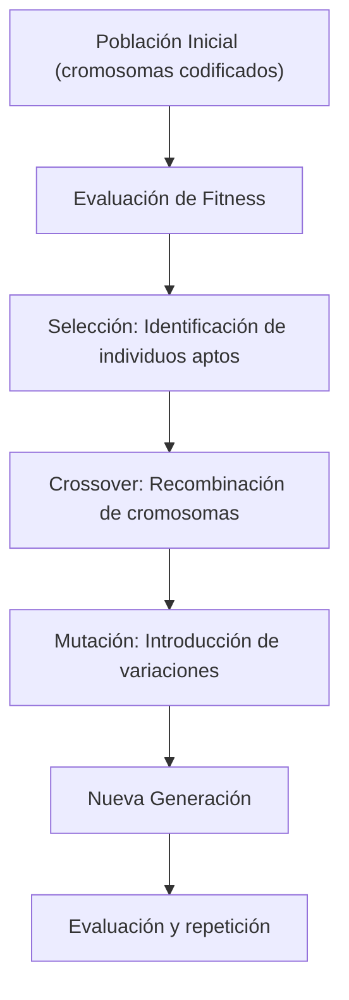
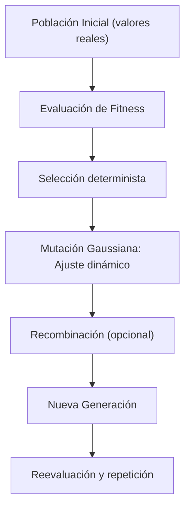
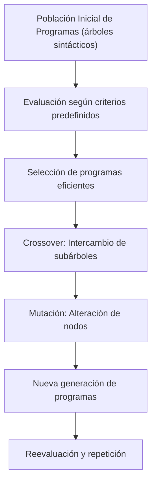
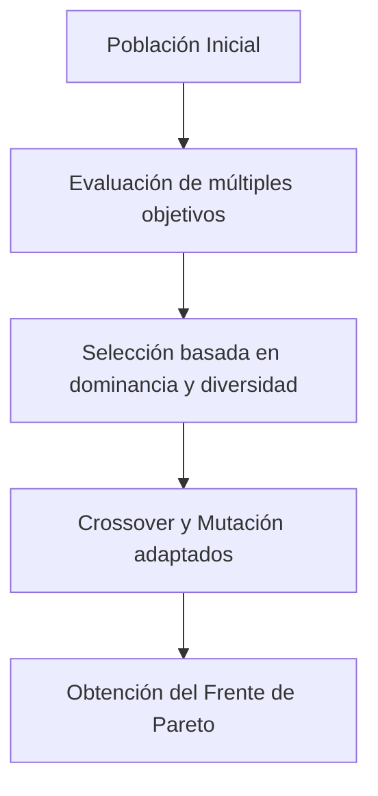

El uso de algoritmos evolutivos ha crecido significativamente en el ámbito de la optimización y la inteligencia artificial. Estos métodos, inspirados en los procesos de evolución biológica, permiten explorar y explotar espacios de soluciones complejos mediante la simulación de la selección natural, el cruce y la mutación. En este post se profundiza en sus fundamentos, metodologías y aplicaciones prácticas, ofreciendo una visión técnica y detallada.

---

## 1. ¿Qué son los Algoritmos Evolutivos?

Los algoritmos evolutivos son técnicas de optimización que imitan la evolución natural para encontrar soluciones a problemas complejos. Su funcionamiento se basa en el manejo de una población de candidatos (soluciones), los cuales evolucionan a lo largo de varias generaciones. Cada individuo es evaluado mediante una función de fitness que cuantifica su calidad en relación con los objetivos del problema.

**Aspectos técnicos clave:**

- **Representación de la solución:**  
  Las soluciones pueden representarse de diversas formas, como cadenas binarias, vectores de números reales o estructuras más complejas. La elección de la representación es crítica, ya que influye en la eficacia de los operadores evolutivos.

- **Operadores genéticos:**  
  - **Selección:** Se escogen los individuos con mayor aptitud para reproducirse. Técnicas comunes incluyen selección por torneo, ruleta o ranking.  
  - **Crossover (cruce):** Combina la información de dos o más "padres" para crear descendientes, permitiendo la recombinación de características y la exploración de nuevas regiones del espacio de soluciones.  
  - **Mutación:** Introduce variaciones aleatorias en los individuos, lo que ayuda a mantener la diversidad genética y evita la convergencia en óptimos locales.

- **Iteración y convergencia:**  
  El proceso se repite generacionalmente hasta alcanzar un criterio de parada, ya sea un número máximo de iteraciones o la estabilización de la calidad de la solución.

---

## 2. Principales Metodologías y Algoritmos

### 2.1. Algoritmos Genéticos

Los **Algoritmos Genéticos (AG)** son quizás la clase más reconocida de algoritmos evolutivos. Se caracterizan por la utilización de una codificación cromosómica de la solución y la aplicación sistemática de operadores genéticos.

**Proceso típico de un Algoritmo Genético:**

1. **Inicialización:** Se genera una población inicial de soluciones aleatorias.  
2. **Evaluación:** Cada individuo se evalúa mediante una función de fitness.  
3. **Selección:** Se seleccionan los individuos más aptos para reproducirse.  
4. **Crossover:** Se combinan partes de los cromosomas de los padres para generar nuevos individuos.  
5. **Mutación:** Se introducen cambios aleatorios para mantener la diversidad.  
6. **Reemplazo:** La nueva generación sustituye a la anterior y se repite el proceso.

**Diagrama - Proceso de un Algoritmo Genético:**

**Aplicaciones técnicas:**  
- Optimización de funciones complejas.  
- Diseño de estructuras y sistemas en ingeniería.  
- Planificación y asignación de recursos en logística.

---

### 2.2. Estrategias Evolutivas

Las **Estrategias Evolutivas (EE)** se orientan principalmente a problemas de optimización en espacios continuos. En lugar de utilizar representaciones binarias, trabajan directamente con variables reales.

**Características técnicas:**

- **Optimización en espacios reales:**  
  Utilizan operadores de mutación basados en perturbaciones gaussianas para modificar parámetros de manera continua.

- **Auto-adaptación:**  
  Los parámetros de la mutación (como la desviación estándar) pueden evolucionar junto con la solución, permitiendo ajustar dinámicamente la intensidad de las variaciones.

- **Selección determinística:**  
  A menudo se emplea una selección basada en criterios deterministas, lo que puede mejorar la convergencia en ciertos problemas.

**Diagrama - Estrategia Evolutiva:**

**Aplicaciones técnicas:**  
- Optimización en diseño de ingeniería (ej. aerodinámica, estructuras).  
- Ajuste de parámetros en sistemas de control y robótica.

---

### 2.3. Programación Genética

La **Programación Genética (PG)** extiende los principios evolutivos a la generación de programas o estructuras de datos. Aquí, cada individuo es un programa representado comúnmente como un árbol sintáctico.

**Aspectos técnicos importantes:**

- **Representación en forma de árboles:**  
  Los nodos internos representan funciones u operadores, y las hojas representan variables o constantes.  
- **Operadores de cruce y mutación específicos:**  
  - **Crossover:** Intercambio de subárboles entre dos programas, facilitando la combinación de subrutinas o módulos funcionales.  
  - **Mutación:** Modificación aleatoria de un nodo o subárbol, lo que puede introducir nuevas estructuras o corregir errores en la lógica.

**Diagrama - Proceso de Programación Genética:**

**Aplicaciones técnicas:**  
- Diseño automático de algoritmos y scripts.  
- Optimización de código y soluciones simbólicas.  
- Modelado de relaciones complejas en datos.

---

### 2.4. Algoritmos Multiobjetivo

En situaciones donde se deben optimizar simultáneamente varios objetivos conflictivos, los **Algoritmos Evolutivos Multiobjetivo** son la solución ideal. Su meta es generar un conjunto de soluciones óptimas, conocido como frente de Pareto.

**Aspectos técnicos relevantes:**

- **Frente de Pareto:**  
  En lugar de una solución única, se obtiene un conjunto de soluciones en el que ninguna es estrictamente mejor que otra en todos los objetivos.  
- **Selección basada en dominancia y diversidad:**  
  Se emplean técnicas que favorecen soluciones que no sean dominadas y que, además, mantengan la diversidad en el conjunto de soluciones.

**Diagrama - Optimización Multiobjetivo:**

**Aplicaciones técnicas:**  
- Diseño de sistemas con restricciones múltiples (por ejemplo, costo vs. rendimiento).  
- Toma de decisiones en ingeniería, donde se deben balancear varios criterios simultáneamente.  
- Optimización de procesos industriales y logísticos.

---

## 3. Aplicaciones Prácticas en Diversos Sectores

Los algoritmos evolutivos se aplican en numerosos campos debido a su flexibilidad y capacidad de adaptación:

- **Ingeniería y Diseño:**  
  - **Optimización estructural:** Diseño de componentes en aeronaves, puentes y edificios, donde se deben equilibrar peso, resistencia y costo.  
  - **Diseño de circuitos electrónicos:** Configuración óptima de componentes para maximizar el rendimiento y la eficiencia energética.

- **Logística y Planificación:**  
  - **Ruteo de vehículos:** Optimización de rutas para minimizar distancias y tiempos de entrega en redes de transporte.  
  - **Asignación de recursos:** Distribución óptima de tareas y recursos en entornos de producción y servicios.

- **Inteligencia Artificial:**  
  - **Sintonización de hiperparámetros:** Ajuste automático de parámetros en modelos de aprendizaje profundo y otras técnicas de machine learning.  
  - **Generación de estrategias:** Desarrollo de estrategias en juegos y simulaciones donde la adaptabilidad es clave.

- **Biología Computacional:**  
  - **Modelado evolutivo:** Simulación de procesos evolutivos y análisis de dinámicas poblacionales en estudios biológicos y genéticos.  
  - **Análisis de secuencias genéticas:** Identificación de patrones y relaciones en datos biológicos complejos.

---

## 4. Desafíos y Tendencias Futuras

Aunque los algoritmos evolutivos ofrecen soluciones robustas y versátiles, también presentan ciertos desafíos técnicos:

- **Convergencia Prematura:**  
  La pérdida de diversidad en la población puede llevar a que el algoritmo se estanque en soluciones subóptimas. Estrategias de reintroducción de diversidad y auto-adaptación de parámetros son áreas activas de investigación.

- **Ajuste de Parámetros:**  
  La determinación óptima de la tasa de mutación, el tamaño de la población y otros parámetros operativos suele ser específica del problema y requiere experimentación o técnicas adaptativas.

- **Coste Computacional:**  
  La evaluación de la función de fitness, especialmente en problemas complejos o en tiempo real, puede ser intensiva en recursos. La paralelización y el cómputo distribuido son tendencias importantes para mejorar la escalabilidad.

- **Integración Híbrida:**  
  Se está explorando la combinación de algoritmos evolutivos con otros métodos, como técnicas de aprendizaje profundo o algoritmos basados en gradiente, para aprovechar las fortalezas de cada enfoque y resolver problemas híbridos.

- **Aplicaciones en Tiempo Real:**  
  Con el avance de la inteligencia artificial en sistemas embebidos y robótica, surge la necesidad de algoritmos evolutivos que puedan operar en tiempo real, adaptándose rápidamente a cambios en el entorno.

---

## 5. Conclusión

Los algoritmos evolutivos representan un paradigma fundamental para abordar problemas de optimización en entornos complejos. Al simular la evolución natural, estos métodos permiten explorar vastos espacios de soluciones, combinando exploración y explotación de forma efectiva. Desde los algoritmos genéticos y las estrategias evolutivas hasta la programación genética y la optimización multiobjetivo, su versatilidad y capacidad de adaptación los hacen indispensables en áreas tan variadas como la ingeniería, la logística, la inteligencia artificial y la biología computacional.

A medida que se resuelven los desafíos técnicos y se integran nuevas tecnologías, los algoritmos evolutivos continuarán evolucionando y ofreciendo soluciones innovadoras en un mundo cada vez más demandante en términos de optimización y eficiencia.

---
