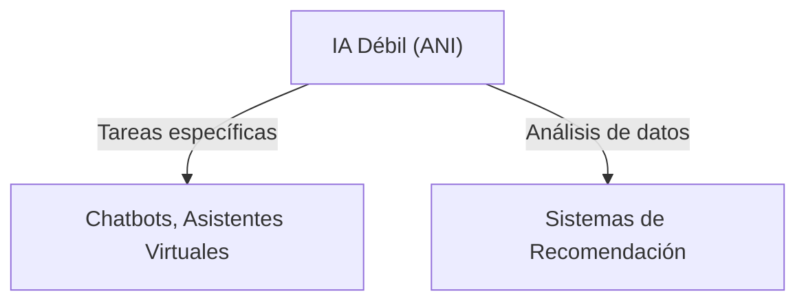
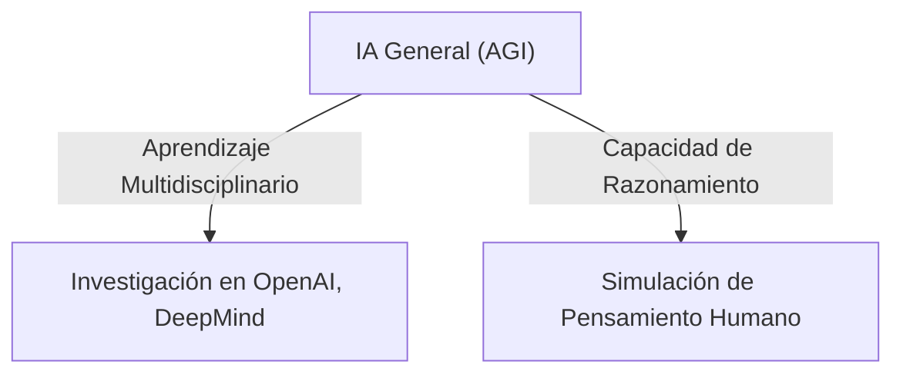
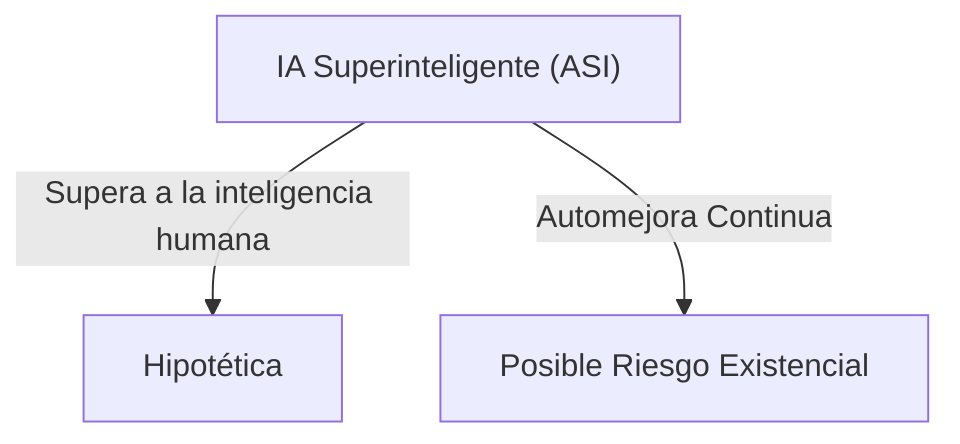

La inteligencia artificial ha transformado rápidamente numerosos sectores, desde la atención al cliente hasta la biomedicina y la industria automotriz. Hoy exploraremos la clasificación de la IA  y detalles técnicos de arquitecturas actuales—como los transformers y sistemas agenticos—para entender su funcionamiento, aplicaciones reales y los desafíos que enfrentamos en su futuro.

## 1. Clasificación de la Inteligencia Artificial
Podemos clasificar la IA según dos ejes principales: sus capacidades (el rango de tareas que pueden realizar) y su funcionalidad (cómo interactúan y aprenden del entorno).

### 1.1. Clasificación por Capacidades
Esta clasificación se centra en la magnitud y versatilidad de la inteligencia que pueden exhibir los sistemas.

| Tipo de IA |Descripción | Ejemplos y Estado Actual |
| -------- | -------- | -------- |
| IA Débil (ANI)     | Realiza tareas específicas sin poseer entendimiento general o autoconsciencia.     | ChatGPT, Siri, Alexa y otros asistentes     |
| IA General (AGI)     | Teóricamente capaz de aprender y razonar en diversas áreas, similar a un humano.     | Proyectos de DeepMind y OpenAI     |
| IA Superinteligente (ASI)     | Superaría la inteligencia humana en todas las dimensiones cognitivas y creativas     | Es hipotética y genera grandes debates éticos     |

### 1.2. Clasificación por Funcionalidad
Esta clasificación describe cómo la IA interactúa con el entorno, la manera en que aprende y responde a estímulos. Un diagrama típico de esta clasificación es:






	
**Máquinas Reactivas**: No tienen memoria ni capacidad de adaptación a partir de experiencias. Ejemplo: Deep Blue, desarrollada por IBM y que jugó ajedrez, analizaba posiciones en tiempo real sin aprender de partidas anteriores.

**Memoria Limitada**: Almacenan temporalmente datos y experiencias para tomar decisiones más sofisticadas. Ejemplo: Coches autónomos que usan datos de sensores en tiempo real para ajustar su comportamiento en el tráfico.

**Teoría de la Mente**: Sistemas en fase de investigación que pretenden interpretar emociones, intenciones y otros aspectos sociales del comportamiento humano. Ejemplo: Robots en proyectos de interacción social (Sophia de Hanson Robotics es un ejemplo emblemático, aunque aún limitado en capacidades reales).

**Autoconsciente**: Un concepto todavía en el terreno de la ciencia ficción; se trataría de sistemas con verdadera conciencia interna. Ejemplo: No existen desarrollos prácticos en este nivel, pero es tema de debate en ética y filosofía de la IA.

## 2. Arquitecturas Modernas: Transformers y Sistemas Agénticos
Las arquitecturas de última generación han transformado la capacidad de los sistemas de IA para procesar información y tomar decisiones autónomas.

### 2.1. Transformers: Revolucionando el Deep Learning
Los transformers han redefinido el procesamiento del lenguaje natural (PLN) y han comenzado a aplicarse en una variedad de tareas, incluso en visión.

Características Clave:

**Mecanismo Self-Attention**: Permite al modelo identificar y ponderar la importancia relativa de cada parte de la entrada, facilitando la comprensión de relaciones a larga distancia en secuencias de datos.

**Procesamiento en Paralelo**: A diferencia de las redes recurrentes, los transformers pueden procesar datos de manera simultánea, acelerando el entrenamiento y escalabilidad.

**Aplicaciones Variadas**: Desde sistemas de generación de texto (ChatGPT, GPT-4) hasta modelos para generación y edición de imágenes (DALL·E, Imagen).

Un ejemplo en python sería:

```python
from transformers import pipeline

# Inicializamos una pipeline para generación de texto utilizando un modelo avanzado.
text_generator = pipeline("text-generation", model="gpt-4")

# Solicitamos una explicación sobre la teoría de la mente en IA
resultado = text_generator("Explícame cómo se aborda la teoría de la mente en sistemas de IA", max_length=150)
print(resultado)
```

Este  snippet utiliza un modelo basado en transformers para responder a una pregunta compleja, evidenciando la flexibilidad y potencia de estos sistemas.

### 2.2. IA Agéntica: Sistema Autónomo y de Toma de Decisiones
La IA agéntica se refiere a sistemas que integran percepción, razonamiento y acción, permitiendo que operen con autonomía en entornos dinámicos.

#### Ejemplos y Detalles:

**Auto-GPT y BabyAGI**: Estos desarrollos demuestran la capacidad para encadenar tareas complejas. No solo generan texto o imágenes, sino que pueden planificar, ejecutar subtareas y ajustar sus acciones en función de objetivos generales.

**Asistentes Virtuales Avanzados**: Más allá de responder a comandos, los asistentes avanzados pueden planificar eventos, gestionar agendas y coordinar acciones.

**Robótica Autónoma y Drones**: En ámbitos como la logística y la defensa, sistemas autónomos utilizan algoritmos agénticos para identificar, analizar y reaccionar a eventos en tiempo real. Ejemplo: Drones militares y robots en almacenes que navegan de manera independiente, adaptándose a obstáculos y cambios en el entorno.

## 3. Aplicaciones de la IA en el Mundo Real
La IA tiene aplicaciones que abarcan múltiples sectores. Estos son algunos casos destacados junto con ejemplos actualizados:


| Sector | Aplicaciones | Ejemplos |
| -------- | -------- | -------- |
| Salud     | Diagnóstico asistido, descubrimiento de fármacos, personalización de tratamientos.     | IBM Watson Health: Utilizado para analizar imágenes médicas y grandes volúmenes de datos genómicos, facilitando diagnósticos y tratamientos personalizados.     |
| Finanzas     | Predicción de mercados, detección de fraudes, asesoría financiera automatizada.     | 	Bloomberg, Kensho Analytics: Algoritmos que analizan patrones de mercado en tiempo real y detectan anomalías en transacciones financieras.     |
| Industria     | Mantenimiento predictivo, optimización de procesos, robots colaborativos en producción.     | 	General Electric y Siemens: Utilizan IA para monitorear equipos industriales, predecir fallas en maquinaria y optimizar líneas de montaje.     |
| Transporte     | Vehículos autónomos, optimización de rutas, gestión de tráfico urbano.     | Waymo, Tesla y Uber ATG: Sistemas que combinan datos de sensores y algoritmos agénticos para desarrollar vehículos autónomos y mejorar la gestión del tráfico.     |
| Marketing     | Personalización de contenidos, análisis de sentimientos, chatbots inteligentes.	     | Netflix, Amazon y Spotify: Emplean IA para recomendar contenido basándose en el comportamiento y preferencias de los usuarios.     |


Estos ejemplos demuestran cómo la IA no solo mejora la eficiencia operativa en cada sector, sino que también abre nuevas oportunidades de innovación y personalización a escala global.

## 4. El Futuro de la IA: Desafíos, Tendencias y Oportunidades
El camino por recorrer en la evolución de la IA es tan prometedor como desafiante. Algunas de las tendencias y áreas de investigación más relevantes incluyen:

### 4.1. Avances hacia la IA General (AGI)
**Transfer Learning y Meta-Learning**: Permiten que los sistemas apliquen conocimientos adquiridos en un dominio a problemas en otro, acercándose a la versatilidad humana.

**Retos**: La integración de diversas habilidades (razonamiento, creatividad, empatía) en un solo sistema presenta enormes desafíos técnicos y éticos que aún se están explorando.

### 4.2. Consolidación de la IA Agéntica en la Vida Cotidiana
**Sistemas Autónomos Distribuidos**: Imagina una red de vehículos autónomos que se comuniquen entre sí para gestionar el tráfico urbano o robots colaborando en ambientes industriales complejos.

**Impacto en el Empleo y la Sociedad**: La automatización avanzada plantea la necesidad de una transición en el ámbito laboral, así como de robustos marcos éticos y regulatorios.

### 4.3. IA Cuántica: La Nueva Frontera Computacional
**Innovación a Escala Exponencial**: Empresas como IBM y Google están desarrollando algoritmos cuánticos que, al integrarse con la IA tradicional, pueden optimizar la resolución de problemas complejos (por ejemplo, simulación de moléculas para desarrollo de fármacos y nuevos materiales).

**Desafíos Técnicos**: La interferencia cuántica y la estabilidad de los qubits aún imponen retos considerables para la escalabilidad práctica.

### 4.4. Regulación, Ética y Transparencia
**Normativas y Políticas Internacionales**: La Unión Europea y otras entidades están implementando marcos regulatorios para garantizar un uso ético y responsable de la IA, evitando riesgos como deepfakes, sesgos algorítmicos y vulneraciones a la privacidad.

**Transparencia y Explicabilidad**: Se intensifica la investigación en modelos interpretables para poder explicar y auditar las decisiones de sistemas complejos, lo que es crucial en ámbitos sensibles como la salud y finanzas.

## 5. Conclusión
La evolución de la inteligencia artificial ya ha generado un impacto transformador, y su futuro promete aún mayores innovaciones. Desde los sistemas especializados—como los basados en transformers que permiten interacciones de lenguaje natural sin precedentes—hasta la emergente IA agéntica que posibilita la toma de decisiones autónoma en entornos dinámicos, la IA está redefiniendo lo que entendemos por eficiencia, personalización e incluso interacción social.

Sin embargo, con estas oportunidades vienen retos significativos en términos de regulación, ética y seguridad. La búsqueda hacia una AGI o el aprovechamiento de la computación cuántica en IA requerirán un equilibrio entre innovación y responsabilidad, asegurando que los beneficios se traduzcan en avances sostenibles para la sociedad.
