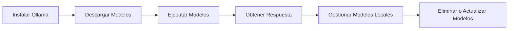

**Ollama** es una herramienta potente que te permite gestionar modelos de lenguaje (LLMs) de manera local, sin depender de servidores externos. En este post, veremos cómo instalar **Ollama** en tu sistema, cómo agregar y ejecutar LLMs, y cómo gestionar modelos locales de manera eficiente. Al final, tendrás una comprensión completa de su uso y podrás empezar a trabajar con tus propios modelos de lenguaje.

## 1. Requisitos previos

Antes de comenzar con la instalación, asegúrate de tener los siguientes requisitos:

- **Sistema operativo compatible**: Ollama es compatible con sistemas Linux, macOS y Windows (en sus versiones más recientes).
- **Docker**: Aunque Ollama simplifica la gestión local, algunas operaciones pueden requerir **Docker** para manejar contenedores.
- **Python**: Si deseas trabajar con scripts personalizados que interactúan con los LLMs, tendrás que tener **Python 3.x** instalado.

Si ya tienes estos requisitos listos, ¡pasemos a la instalación!

## 2. Instalación de Ollama
En la página oficial de [Ollama.com](https://ollama.com) puedes encontrar los instaladores y modelos necesarios para empezar a funcionar en pocos clicks, pero si necesitas realizar la instalación por consola puedes seguir los siguientes pasos.
### 2.1. Instalación en **macOS** y **Linux**

Para instalar **Ollama** en sistemas macOS y Linux, puedes usar el siguiente comando:

```bash
curl -sSL https://ollama.com/install.sh | bash
```

Este comando descargará e instalará el script de instalación de Ollama. Después de ejecutarlo, verás la herramienta lista para usar.

### 2.2. Instalación en **Windows**

En Windows, la instalación es un poco diferente. Deberás usar **Windows Subsystem for Linux (WSL)** para instalar Ollama de manera efectiva. Aquí tienes los pasos:

1. Instala **WSL** a través de PowerShell:

```powershell
wsl --install
```

2. Una vez que WSL esté listo, abre tu terminal **bash** (Linux) y ejecuta:

```bash
curl -sSL https://ollama.com/install.sh | bash
```

Esto instalará Ollama en tu entorno WSL, permitiéndote gestionar tus LLMs localmente.

### 2.3. Verificación de la instalación

Para verificar que la instalación fue exitosa, ejecuta el siguiente comando:

```bash
ollama --version
```

Este comando mostrará la versión de Ollama instalada, lo que confirma que todo ha ido bien.

## 3. ¿Qué es un LLM?

Un **Modelo de Lenguaje de Gran Escala (LLM)** es un tipo de modelo de IA entrenado para entender y generar texto en lenguaje humano. Algunos ejemplos comunes incluyen GPT (Generative Pre-trained Transformer), BERT, T5, entre otros.

Con **Ollama**, puedes gestionar estos modelos en tu máquina local, ya sea para tareas de procesamiento de texto, generación de contenido, traducción, o incluso análisis de datos.

## 4. Cómo gestionar LLMs con Ollama

Una vez que Ollama está instalado, puedes empezar a gestionar tus modelos LLM locales.

### 4.1. Agregar un LLM

Para agregar un modelo, usa el siguiente comando:

```bash
ollama pull <nombre-del-modelo>
```

Por ejemplo, si quieres agregar el modelo qwen2.5-coder, el comando sería:

```bash
ollama pull qwen2.5-coder
```

Este comando descargará el modelo correspondiente y lo instalará en tu máquina. Si no especificas un modelo, Ollama buscará el modelo por defecto configurado en tu sistema.

### 4.2. Ejecutar un modelo

Para ejecutar un modelo descargado, usa:

```bash
ollama run <nombre-del-modelo> --prompt "Escribe tu consulta aquí"
```

Por ejemplo:

```bash
ollama run qwen2.5-coder --prompt "¿Cómo se instala Ollama?"
```

Esto hará que el modelo genere una respuesta en función del **prompt** que le des. Es importante entender que el **prompt** puede ser cualquier texto que desees que el modelo procese.

### 4.3. Administrar modelos instalados

Para ver qué modelos tienes instalados en tu máquina, utiliza:

```bash
ollama list
```

Este comando mostrará una lista de todos los modelos LLM descargados y disponibles en tu sistema.

### 4.4. Eliminar un modelo

Si ya no necesitas un modelo, puedes eliminarlo con:

```bash
ollama remove <nombre-del-modelo>
```

Por ejemplo:

```bash
ollama remove qwen2.5-coder
```

### 4.5. Ver detalles del modelo

Si deseas obtener más información sobre un modelo específico, puedes usar:

```bash
ollama info <nombre-del-modelo>
```

Este comando te proporcionará detalles sobre el modelo, como su tamaño, capacidades y la fecha de la última actualización.

### 5.6. Tabla resumen

| Comando | Descripción | Ejemplo |
| -------- | -------- | -------- |
| ollama pull  [modelo]	     | Descarga un modelo específico en tu máquina local.     | ollama pull qwen2.5-coder     |
| ollama run [modelo]     | Ejecuta un modelo con un prompt personalizado y genera una respuesta.	     | ollama runqwen2.5-coder  --prompt "¿Qué es Ollama?"     |
| ollama list	     | Lista todos los modelos instalados localmente en tu sistema.     | ollama list     |
| ollama remove [modelo]	     | Elimina un modelo previamente descargado de tu máquina.	     | ollama remove qwen2.5-coder   |
| ollama info [modelo]     | Proporciona detalles técnicos sobre un modelo, como tamaño y fecha de actualización.     | ollama info qwen2.5-coder     |
| ollama --version	     | Verifica la versión actual de Ollama instalada en tu sistema.	     | ollama --version    |
	
	
## 5. Uso avanzado: Integración con scripts

Si deseas integrar **Ollama** con tus propios scripts para automatizar tareas, puedes usar los siguientes ejemplos de código

### 5.1. Python

Este script de Python ejecuta el modelo **qwen2.5-coder** a través de **Ollama** y devuelve la respuesta generada. 

```python
import subprocess

# Ejecutar Ollama para obtener la respuesta de qwen2.5-coder
def get_llm_response(prompt):
    result = subprocess.run(['ollama', 'run', 'qwen2.5-coder', '--prompt', prompt], stdout=subprocess.PIPE)
    return result.stdout.decode('utf-8')

# Probar la función
prompt = "¿Qué es Ollama?"
response = get_llm_response(prompt)
print(response)
```

### 5.2. Java

Este script de Java (con Spring AI) ejecuta el modelo **qwen2.5-coder** a través de **Ollama** y devuelve la respuesta generada. 

```java

public class OllamaIntegration {

    // Función que realiza la llamada al modelo
    public static ChatResponse callOllamaModel(String query, String model, double temperature) {
        // Inicializamos el modelo de Chat
        ChatModel chatModel = new ChatModel(); // Asegúrate de instanciar correctamente tu modelo

        // Realizamos la llamada al modelo con los parámetros especificados
        ChatResponse response = chatModel.call(
            new Prompt(
                query,
                OllamaOptions.builder()
                    .model(model)
                    .temperature(temperature)
                    .build()
            )
        );

        // Devolvemos la respuesta
        return response;
    }

    // Método principal para probar la función
    public static void main(String[] args) {
        // Llamada a la función
        ChatResponse response = callOllamaModel("¿Qué es Ollama?", "qwen2.5-coder", 0.3);

        // Imprimimos la respuesta del modelo
        System.out.println("Respuesta del modelo: " + response);
    }
}

````

### 5.3. Javascript

Este código de javascript ejecuta el modelo **qwen2.5-coder** a través de **Ollama** y devuelve la respuesta generada. 

```javascript
const { exec } = require('child_process');

// Función que realiza la llamada al modelo
function callOllamaModel(prompt, model, temperature) {
    return new Promise((resolve, reject) => {
        // Construcción del comando para ejecutar Ollama
        const command = `ollama run ${model} --prompt "${prompt}" --temperature ${temperature}`;

        // Ejecución del comando en el terminal
        exec(command, (error, stdout, stderr) => {
            if (error) {
                return reject(`Error al ejecutar Ollama: ${error.message}`);
            }
            if (stderr) {
                return reject(`Error en la respuesta de Ollama: ${stderr}`);
            }
            resolve(stdout.trim()); // Devuelve la respuesta
        });
    });
}

// Llamada a la función 
(async () => {
    try {
        const response = await callOllamaModel("¿Qué es Ollama?", "qwen2.5-coder", 0.3);
        console.log("Respuesta del modelo:", response);
    } catch (error) {
        console.error("Error:", error);
    }
})();

```

## 6. Ejemplo gráfico: Flujo de trabajo con Ollama

Para entender mejor el flujo de trabajo de **Ollama**, vamos a ver un diagrama de cómo se conecta el proceso de instalación, ejecución y gestión de modelos:



Este diagrama muestra el ciclo completo de gestión de LLMs usando Ollama: desde la instalación, la descarga de modelos, la ejecución, hasta la gestión de los modelos locales.

## 7. Conclusión

**Ollama** es una herramienta muy útil para quienes desean gestionar modelos LLM de manera local. Con su instalación sencilla y comandos intuitivos, puedes empezar a experimentar con modelos de lenguaje avanzados en minutos. Además, la capacidad de integrarse con Python, Java, Javascript u otros lenguajes y automatizar procesos hace que Ollama sea aún más poderoso para desarrolladores y técnicos que buscan personalizar sus flujos de trabajo.

Con este post, deberías estar listo para comenzar a usar **Ollama** y explorar sus capacidades. ¡Ahora es tu turno de empezar a gestionar modelos LLM de forma local!
