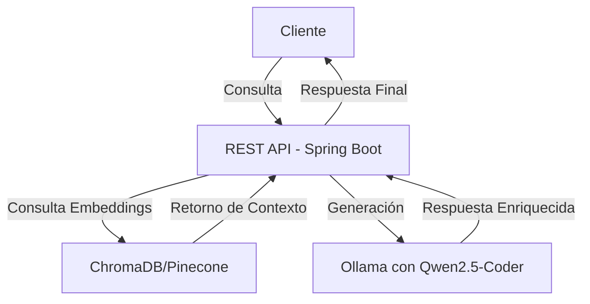

Los sistemas **RAG (Retrieval-Augmented Generation)** combinan modelos generativos de lenguaje con un mecanismo de recuperación de datos externos. Esto permite enriquecer las respuestas del modelo con información actualizada y relevante.

En este post, aprenderás a construir un microservicio con **Spring Boot**, **Spring AI** y **Spring Data** que implementa RAG, utilizando una base de datos **vectorial** para almacenar y recuperar información. Usaremos **Ollama** con el modelo **Qwen2.5-Coder**, que está optimizado para tareas de generación y asistencia en programación.

---

## Tecnologías utilizadas

- **Spring Boot** (para la estructura del microservicio)
- **Spring AI** (para la integración con modelos de lenguaje)
- **Spring Data** (para persistencia)
- **ChromaDB** o **Pinecone** (para almacenamiento vectorial)
- **Ollama con Qwen2.5-Coder** (como modelo generativo)
- **Docker** (para despliegue)

---

## Arquitectura del Microservicio



El flujo es el siguiente:
1. **El cliente envía una consulta** al microservicio.
2. **Se busca información relevante** en la base de datos vectorial (ChromaDB o Pinecone).
3. **Se envía la consulta y el contexto** recuperado al modelo generativo (Ollama con Qwen2.5-Coder).
4. **Se genera una respuesta enriquecida** combinando la información del usuario con la recuperada.
5. **El microservicio responde al cliente** con la información procesada.

---

## Paso 1: Configurar Ollama con Qwen2.5-Coder

Ollama es una plataforma para ejecutar modelos de lenguaje localmente. Primero, instalamos Ollama:

```sh
curl -fsSL https://ollama.com/install.sh | sh
```

Luego, descargamos el modelo **Qwen2.5-Coder**:

```sh
ollama pull qwen2.5-coder
```

Para verificar que Ollama está funcionando correctamente:

```sh
ollama run qwen2.5-coder "Escribe un hola mundo en Python"
```

Esto ejecuta el modelo en local y debería devolver un código en Python.


> Si quieres consultar una guía detallada puedes verla en este post: [Gestiona tus LLMs locales con Ollama: Guía completa de instalación](https://blog.kpucha.dev/posts/gestiona-tus-llms-locales-con-ollama-guia-completa-de-instalacion/).
{: .prompt-info }


---

## Paso 2: Configurar un proyecto Spring Boot

Puedes generar el proyecto de dos formas:

### Opción 1: Usando Spring CLI

Si tienes instalada la **Spring Boot CLI**, puedes crear el proyecto ejecutando:

```sh
spring init --dependencies=web,data-jpa,devtools,spring-ai -n rag-microservice rag-microservice
```

Esto creará un nuevo proyecto en la carpeta `rag-microservice` con las dependencias básicas, incluyendo **Spring AI**.

### Opción 2: Usando Spring Initializr

También puedes generar el proyecto desde [Spring Initializr](https://start.spring.io/):

1. Selecciona **Spring Boot 3.x**.
2. Agrega las siguientes dependencias:
   - **Spring Web** (para la API REST)
   - **Spring Data JPA** (para la persistencia de datos)
   - **Spring AI** (para la integración con modelos de lenguaje)
   - **Lombok** (para reducir código repetitivo)
3. Genera el proyecto y descárgalo.

Una vez descargado, descomprime y navega a la carpeta del proyecto:

```sh
cd rag-microservice
mvn clean install
```

---

## Paso 3: Configurar Ollama en Spring AI

Puedes configurar la conexión a Ollama usando **application.properties** o **application.yml**.

### Opción 1: Usando `application.properties`

```properties
spring.ai.ollama.base-url=http://localhost:11434
spring.ai.ollama.chat.model=qwen2.5-coder
```

### Opción 2: Usando `application.yml`

```yaml
spring:
  ai:
    ollama:
      base-url: http://localhost:11434
      chat:
        model: qwen2.5-coder
```

**Explicación de los parámetros:**
- `base-url`: URL donde se ejecuta Ollama.
- `chat.model`: Modelo de lenguaje que se usará para generar respuestas.

---

## Paso 4: Instalación y configuración de ChromaDB

ChromaDB es una base de datos vectorial que permite almacenar y recuperar embeddings. Instalémosla con Docker:

```sh
docker run -p 8000:8000 ghcr.io/chroma-core/chroma:latest
```

Para conectarla desde Spring Boot, añadimos en `application.yml`:

```yaml
spring:
  ai:
    chromadb:
      base-url: http://localhost:8000
```

---

## Paso 5: Implementar el servicio de embeddings

Spring AI permite generar embeddings para almacenar textos en una base de datos vectorial. Implementamos un servicio que guarde documentos en ChromaDB.

```java
@Service
public class EmbeddingService {

    private final ChromaDb chromaDb;
    private final EmbeddingModel embeddingModel;

    public EmbeddingService(ChromaDb chromaDb, EmbeddingModel embeddingModel) {
        this.chromaDb = chromaDb;
        this.embeddingModel = embeddingModel;
    }

    public void guardarDocumento(String id, String texto) {
        List<Float> embedding = embeddingModel.embed(texto);
        chromaDb.add(id, embedding, texto);
    }
}
```

---

## Paso 6: Implementar la recuperación de contexto

Ahora, implementamos el servicio que buscará información en la base de datos vectorial cuando reciba una consulta.

```java
@Service
public class RetrievalService {

    private final ChromaDb chromaDb;
    private final OllamaChatModel chatModel;

    public RetrievalService(ChromaDb chromaDb, OllamaChatModel chatModel) {
        this.chromaDb = chromaDb;
        this.chatModel = chatModel;
    }

    public String obtenerRespuesta(String consulta) {
        List<String> contexto = chromaDb.search(consulta, 5);  // TOP 5 resultados
        String prompt = "Usa esta información: " + String.join("\n", contexto) +
                        "\nPregunta: " + consulta;
        return chatModel.generate(prompt);
    }
}
```

---

## Conclusión

Hemos creado un **microservicio RAG** con **Spring Boot**, **Spring AI**, **Ollama con Qwen2.5-Coder** y **ChromaDB**. Ahora puedes ampliar este servicio con mejoras como autenticación, almacenamiento de conversaciones o un frontend.
