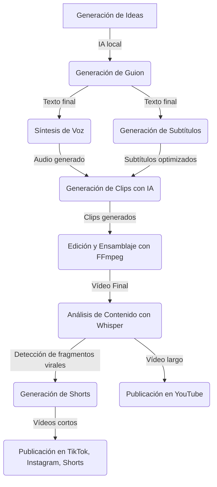

## **1. Arquitectura General** 

El sistema se basará en una arquitectura modular, dividiendo las tareas en diferentes **agentes especializados** que trabajarán de forma coordinada mediante **n8n**.  

### **📌 Componentes Principales**  

1️⃣ **Entrada de Datos**  
   - Agente de generación de ideas (LLM en local)  
   - Alternativa: Google Sheets / Base de Datos  

2️⃣ **Procesamiento de Contenido**  
   - Agente de generación de guiones (LLM)  
   - Agente de generación de subtítulos y descripciones  
   - Agente de síntesis de voz (**F5 TTS**)  

3️⃣ **Producción de Vídeo**  
   - Generación de clips con **Stable Video Diffusion / ModelScope**  
   - Uso de imágenes libres de derechos o generadas  
   - Ensamblaje con **FFmpeg** y mejoras con **Rife AI**  

4️⃣ **Publicación y Monetización**  
   - Generación de vídeo largo para YouTube  
   - Extracción de fragmentos más virales para Shorts/TikTok  
   - Generación de vídeos cortos optimizados para viralidad  
   - Subida automática a YouTube, TikTok, Instagram y otras plataformas  

---

## **2. Esquema de Conexión entre Componentes**  

📍 **Flujo de Trabajo General**  

📌 **Tecnologías Usadas en Cada Etapa**  

| Módulo                   | Tecnología / Herramienta                |
|--------------------------|-----------------------------------------|
| Generación de Ideas      | LLM local (Mistral 7B, Phi-2, Mixtral) |
| Generación de Guion      | GPT-4All / Mixtral / Ollama            |
| Síntesis de Voz (TTS)    | **F5 TTS** / Coqui TTS                 |
| Generación de Clips      | Stable Video Diffusion, ModelScope     |
| Edición y Ensamblaje     | FFmpeg + Rife AI                       |
| Detección de Momentos Virales | Whisper AI + Análisis de Engagement |
| Generación de Shorts     | FFmpeg (recorte automático)            |
| Publicación Automática   | n8n + API de YouTube / TikTok          |

---

## **3. Arquitectura de Software**  

### **📌 Elección de Infraestructura**  

✅ **Sistema Operativo:** Windows 11 (posible opción de Linux si mejora el rendimiento)  
✅ **Orquestación:** **n8n** (automatización de procesos sin necesidad de código complejo)  
✅ **Gestión de Modelos de IA:** **Ollama, LMStudio, Hugging Face**  
✅ **Bases de Datos:** PostgreSQL / MongoDB / ChromaDB (para embeddings)  

📍 **Ejemplo de Flujo en n8n:**  

1. **Agente de IA obtiene una idea de contenido**  
2. **El guion se genera y almacena en la base de datos**  
3. **Se genera la voz con F5 TTS**  
4. **Se crean los clips y se ensamblan con FFmpeg**  
5. **Se analizan los fragmentos más virales con Whisper AI**  
6. **Se generan Shorts y se formatean automáticamente**  
7. **El vídeo largo se sube a YouTube**  
8. **Los vídeos cortos se publican en TikTok, Instagram y YouTube Shorts**  

---

## **4. Infraestructura Local y de Hardware**  

🔹 **CPU:** Procesador 8 núcleos
🔹 **GPU:** **AMD RX 590X** 
🔹 **RAM:** Mínimo 32GB 
🔹 **Almacenamiento:** SSD 1TB
