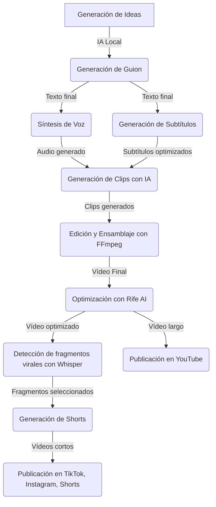
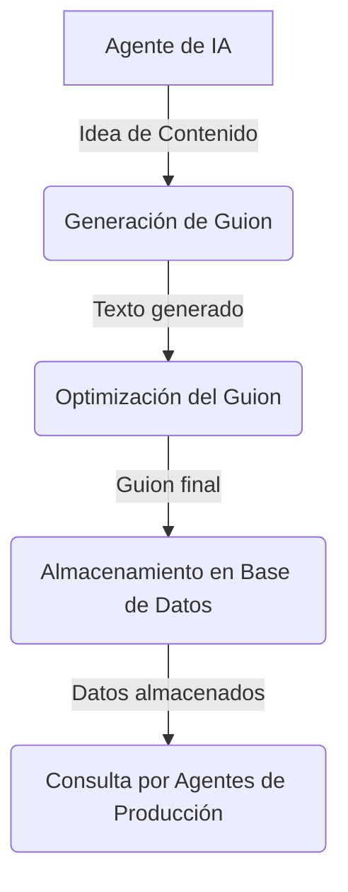
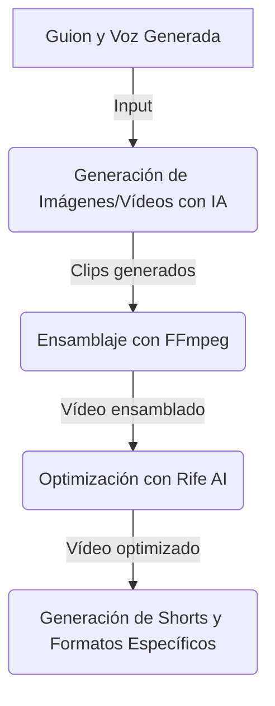
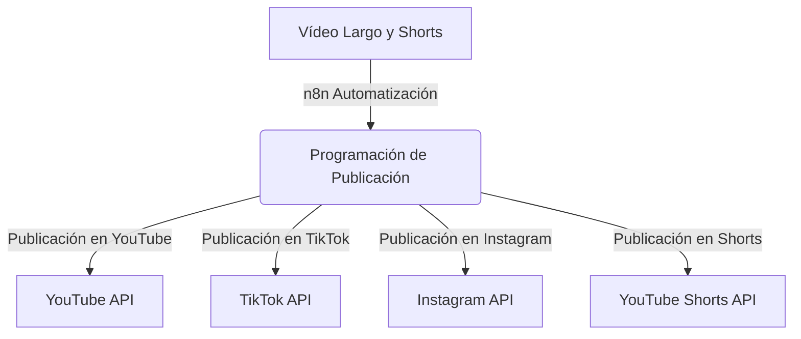
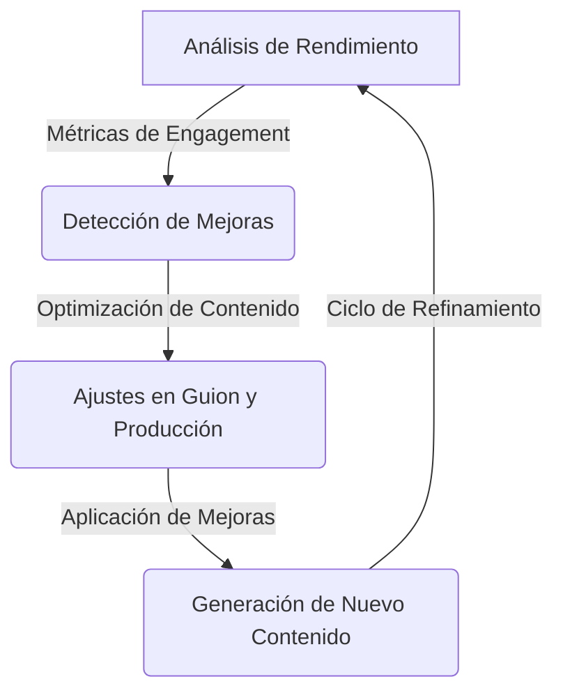

## **1. Flujo General del Sistema**

---

## **2. Generación de Contenido**

---

## **3. Producción de Video**

---

## **4. Automatización de Publicación**

---

## **5. Optimización y Ajuste de Resultados**

