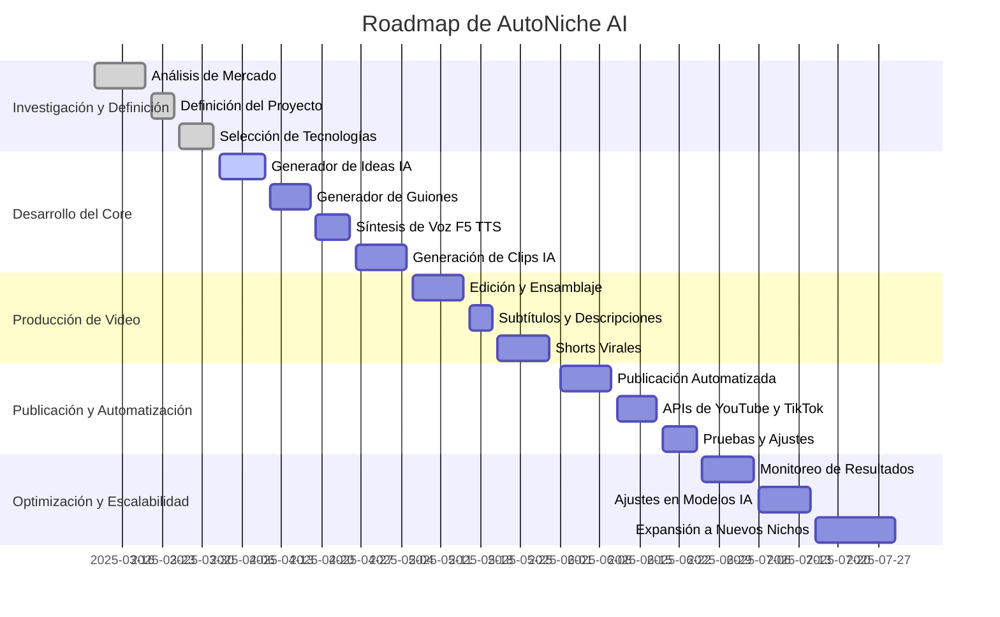

La planificación del roadmap define las fases clave del desarrollo de **AutoNiche AI**, estableciendo prioridades y plazos realistas para su implementación.

---

## **1. Fases del Proyecto**

### 📌 **Fase 1: Investigación y Definición (Semana 1 - 2)**

#### Análisis del mercado y tendencias en contenido automatizado.

> [Análisis del mercado]() 
{: .prompt-tip }
	
#### Definición del alcance y objetivos del proyecto.

>  [Idea Brief]() 
{: .prompt-tip }
>  [Definición de requerimientos]() 
{: .prompt-tip }

#### Selección de tecnologías y herramientas a utilizar.
>  [Selección tecnológica]() 
{: .prompt-tip }
>  [Ollama]() 
{: .prompt-tip }
> [LM Studio]()
{: .prompt-tip }
> Pinokio
{: .prompt-info }
> [n8n]()
{: .prompt-tip }
> ChromaDB
{: .prompt-info }
> PostgreSQL
{: .prompt-info }
> MongoDB
{: .prompt-info }
> Aquí estamos
{: .prompt-warning }

#### Planificación de arquitectura y diagramas de flujo.

>  [Arquitectura del Sistema]() 
{: .prompt-tip }
>  [Diagramas de Flujo]() 
{: .prompt-tip }

### 📌 **Fase 2: Desarrollo del Core del Sistema (Semana 3 - 6)**
#### Implementación del sistema de generación de ideas con IA.

> Pendiente
{: .prompt-danger }

####  Desarrollo del generador de guiones optimizado.

> Pendiente
{: .prompt-danger }

#### Integración de la síntesis de voz con F5 TTS.

> Pendiente
{: .prompt-danger }

####  Implementación inicial de generación de clips con IA.

> Pendiente
{: .prompt-danger }

### 📌 **Fase 3: Ensamblaje y Producción de Video (Semana 7 - 10)**

#### Integración de herramientas de edición y ensamblaje (FFmpeg, Rife AI).

> Pendiente
{: .prompt-danger }

#### Generación de subtítulos y descripciones optimizadas.

> Pendiente
{: .prompt-danger }

#### Implementación de detección de fragmentos virales para shorts.

> Pendiente
{: .prompt-danger }

#### Creación del pipeline de producción de contenido.

> Pendiente
{: .prompt-danger }

### 📌 **Fase 4: Publicación y Automatización (Semana 11 - 14)**

#### Desarrollo del flujo de publicación automatizada con n8n.

> Pendiente
{: .prompt-danger }

#### Configuración de APIs para YouTube, TikTok, Instagram y Shorts.

> Pendiente
{: .prompt-danger }

#### Pruebas de carga y optimización del flujo de trabajo.

> Pendiente
{: .prompt-danger }

#### Implementación de estrategias SEO y engagement.

> Pendiente
{: .prompt-danger }

### 📌 **Fase 5: Optimización y Escalabilidad (Semana 15 - 18)**

#### Monitoreo de métricas de rendimiento.

> Pendiente
{: .prompt-danger }

#### Ajuste de modelos y optimización de generación de contenido.

> Pendiente
{: .prompt-danger }

#### Implementación de mejoras en la generación de clips y voces.

> Pendiente
{: .prompt-danger }

#### Escalado del sistema para múltiples canales y nichos.

> Pendiente
{: .prompt-danger }

---

## **2. Cronograma General**

---
