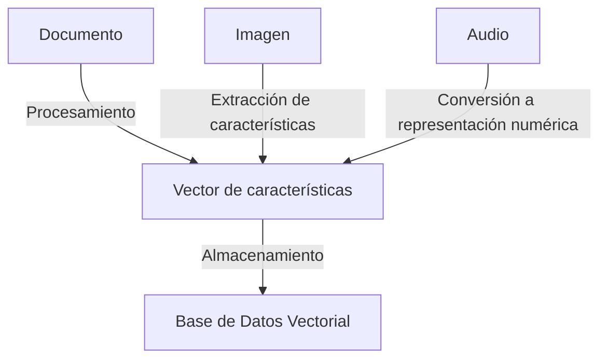
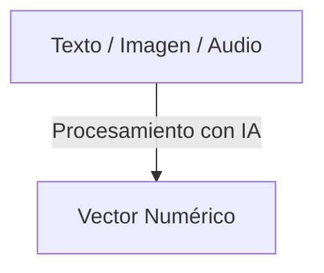
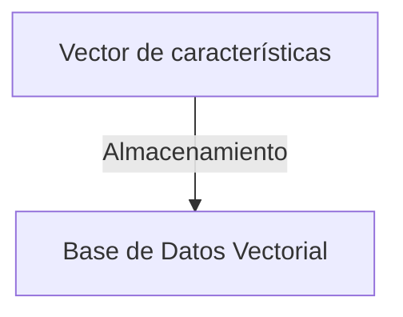
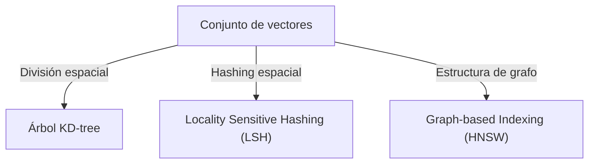
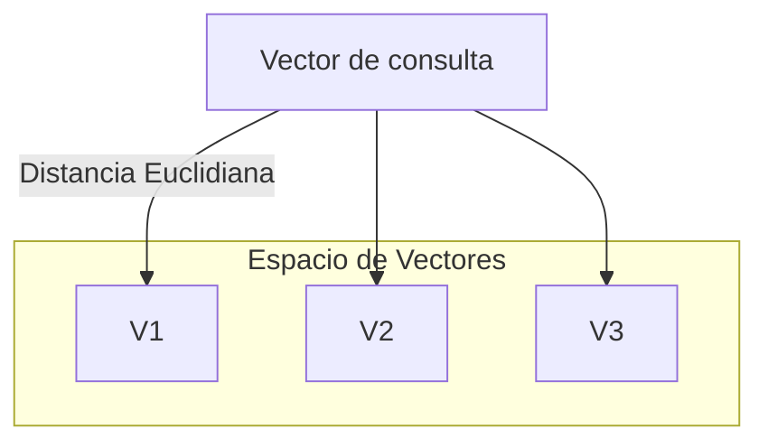

Las bases de datos vectoriales son una tecnología clave en la inteligencia artificial moderna, especialmente en la búsqueda semántica, el aprendizaje automático y el procesamiento de lenguaje natural.

## 1. ¿Qué es una Base de Datos Vectorial?

A diferencia de las bases de datos relacionales que almacenan información en forma de tablas con filas y columnas, las bases de datos vectoriales almacenan los datos como **vectores numéricos en un espacio multidimensional**. Cada elemento (texto, imagen, audio, etc.) se representa como un punto en este espacio en función de sus características extraídas a través de modelos de aprendizaje automático.

El objetivo principal de estas bases de datos es **permitir búsquedas rápidas y precisas basadas en similitudes**. Mientras que en las bases de datos tradicionales la búsqueda se basa en coincidencias exactas de texto o valores, en las bases de datos vectoriales se pueden encontrar elementos similares basados en la cercanía de sus vectores en el espacio multidimensional.



## 2. ¿Para Qué Sirven?

Las bases de datos vectoriales son fundamentales en la búsqueda y recuperación eficiente de información basada en similitud. Sus principales aplicaciones incluyen:

- **Búsqueda semántica**: Permiten encontrar documentos, imágenes o audios en función de su significado, en lugar de una coincidencia exacta de palabras.
- **Motores de recomendación**: Se usan para recomendar productos, música o contenido en función del historial y preferencias del usuario.
- **Procesamiento de lenguaje natural**: En aplicaciones como chatbots y asistentes virtuales, permiten recuperar respuestas relevantes según la semántica de las preguntas.
- **Reconocimiento de imágenes y videos**: Comparan imágenes en función de sus características visuales, en lugar de depender solo de etiquetas o nombres de archivos.
- **Sistemas de seguridad y biometría**: Identificación de rostros o huellas dactilares basándose en la similitud entre vectores.
- **Detección de anomalías**: Se usan en seguridad cibernética y monitoreo de fraudes para identificar actividades inusuales en datos.
- **Sistemas de recomendación**: Comparan las preferencias de los usuarios con opciones disponibles (como productos, música o películas) para generar recomendaciones personalizadas.

## 3. ¿Cómo Funcionan?

El flujo típico de uso de una base de datos vectorial en IA involucra cuatro pasos fundamentales:

### 3.1. Conversión de datos en vectores

Los datos en bruto, como imágenes, texto o audio, **se convierten en vectores** usando modelos de aprendizaje automático. Ejemplos incluyen modelos de embedding como Word2Vec para texto o redes neuronales convolucionales (CNN) para imágenes.



### 3.2. Almacenamiento en la base de datos vectorial

Los vectores generados se **almacenan en una base de datos especializada**, optimizada para realizar búsquedas rápidas en grandes volúmenes de datos.



### 3.3. Indexación de los datos

Para recuperar la información rápidamente, se utilizan estructuras de datos especializadas:



### 3.2. Búsqueda basada en similitud

Para encontrar elementos similares a una consulta, se comparan los **vectores** utilizando diferentes métricas:



## 7. Implementación Básica en Python

Para ilustrar cómo utilizar una base de datos vectorial, aquí hay un ejemplo simple utilizando FAISS:

```python
import faiss
import numpy as np

# Crear una base de datos de 1000 vectores aleatorios de 128 dimensiones
d = 128  # Dimensión de los vectores
nb = 1000  # Número de vectores
np.random.seed(42)
database = np.random.random((nb, d)).astype('float32')

# Crear el índice de FAISS
index = faiss.IndexFlatL2(d)  # Distancia Euclidiana
index.add(database)  # Agregar vectores a la base de datos

# Crear un vector de consulta
query = np.random.random((1, d)).astype('float32')

# Buscar los 5 vectores más cercanos
D, I = index.search(query, 5)
print("Índices de los vectores más cercanos:", I)
print("Distancias:", D)
```

## 8. Conclusión

Las bases de datos vectoriales son un componente esencial en la inteligencia artificial moderna, permitiendo búsquedas más inteligentes y eficientes en grandes volúmenes de datos. Gracias a ellas, los modelos de IA pueden comprender mejor el significado de la información y ofrecer respuestas más relevantes y precisas. Su implementación en motores de búsqueda, chatbots, sistemas de recomendación y ciberseguridad demuestra su versatilidad y eficiencia en el mundo real.
