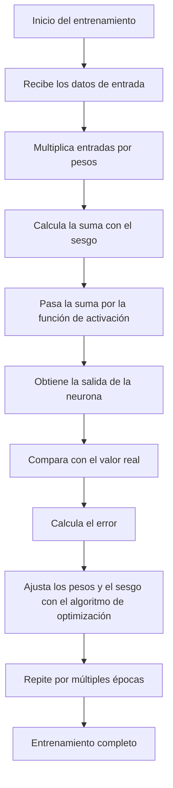

---

En este post, vamos a profundizar en el proceso de creación y entrenamiento de una neurona en redes neuronales artificiales. Vamos a explicar desde los conceptos básicos hasta las técnicas avanzadas, incluyendo la inicialización de pesos, funciones de activación, y cómo saber cuándo has terminado el entrenamiento o si tu red ha sufrido **muerte de neurona**.

---

### **1. ¿Qué es una Neurona Artificial?**

Una neurona artificial es la unidad básica de una red neuronal. Funciona de manera similar a una neurona en el cerebro humano, recibiendo entradas, procesándolas y proporcionando una salida. En términos de redes neuronales, las neuronas son usadas para modelar relaciones entre las entradas y las salidas.

#### **Proceso Básico de una Neurona:**

- **Entrada (x)**: Recibe los valores de entrada.
- **Pesos (w)**: Cada entrada se multiplica por un peso, que indica la importancia de esa entrada.
- **Suma ponderada (z)**: La multiplicación de cada entrada por su peso se suma con un valor llamado **sesgo (b)**.
- **Función de activación**: La suma ponderada se pasa a través de una función de activación, que determina la salida de la neurona.

La ecuación general de una neurona es:

$$
y = f(w_1x_1 + w_2x_2 + ... + w_nx_n + b)
$$

Donde:

- $$ (y) $$ es la salida de la neurona,
- $$ (x_1, x_2, ..., x_n) $$ son las entradas,
- $$ (w_1, w_2, ..., w_n) $$ son los pesos correspondientes,
- $$ (b) $$ es el sesgo,
- $$ (f) $$ es la función de activación.

---

### **2. Entrenamiento de la Neurona**

El **entrenamiento de una neurona** es el proceso mediante el cual ajustamos los pesos y el sesgo para que la salida de la neurona se aproxime a la salida esperada, utilizando datos de entrenamiento.

#### **Pasos del Entrenamiento:**

1. **Inicialización de Pesos**: Inicializamos los pesos con valores pequeños y aleatorios.
2. **Propagación hacia adelante (Forward Propagation)**: Calculamos la salida de la neurona usando los valores de entrada, los pesos y la función de activación.
3. **Cálculo del Error**: Comparamos la salida de la neurona con la salida deseada y calculamos el error (diferencia entre la predicción y la verdad).
4. **Retropropagación (Backpropagation)**: Calculamos el gradiente del error con respecto a los pesos y el sesgo, y ajustamos estos parámetros utilizando un algoritmo de optimización como **descenso de gradiente**.
5. **Repetición**: Repetimos este proceso a lo largo de múltiples iteraciones o épocas hasta que el error sea lo suficientemente pequeño.

#### **Tasa de Aprendizaje**:

Es un parámetro clave que controla cuán grandes son los ajustes que hacemos a los pesos durante el entrenamiento. Un valor muy alto puede hacer que el modelo se vuelva inestable, mientras que un valor muy bajo puede hacer que el modelo aprenda demasiado lento.

---

### **3. Métodos de Inicialización de Pesos**

La **inicialización de pesos** es fundamental para que la red neuronal comience a entrenarse correctamente. Existen diferentes métodos que ayudan a evitar problemas como el **desvanecimiento de gradientes** o la **explosión de gradientes**.

#### **Inicialización Xavier (Glorot)**

- **Descripción**: Diseñado para redes que usan funciones de activación **sigmoides** o **tanh**.
- **Cálculo**: Los pesos se inicializan con una distribución aleatoria con media 0 y varianza  $$(\frac{2}{n_{in} + n_{out}}), donde (n_{in}) $$ es el número de entradas y  $$(n_{out}) $$ es el número de salidas.
- **Ventaja**: Ayuda a mantener los gradientes estables durante el entrenamiento, evitando que se desvanecen o exploten.

#### **Inicialización He**

- **Descripción**: Específicamente útil para redes que usan **ReLU** como función de activación.
- **Cálculo**: Los pesos se inicializan con una distribución normal de media 0 y varianza  $$(\frac{2}{n_{in}}) $$, donde  $$(n_{in}) $$ es el número de entradas a la neurona.
- **Ventaja**: Evita la **muerte de neuronas** en redes profundas, proporcionando un rango adecuado de valores para que las neuronas puedan activarse y aprender.

---

### **4. Funciones de Activación y sus Diferencias**

Las **funciones de activación** son esenciales para introducir **no linealidad** en la red neuronal, lo que permite a la red aprender relaciones complejas. A continuación, describo las funciones más comunes y sus características.

#### **Función Sigmoide (Logística)**

- **Fórmula**:
  $$
  \sigma(x) = \frac{1}{1 + e^{-x}}
  $$
- **Rango de salida**: [0, 1].
- **Ventaja**: Buena para problemas de **clasificación binaria**.
- **Desventaja**: Problema de **desvanecimiento de gradientes**; la salida tiende a quedar saturada en 0 o 1, haciendo que los gradientes se vuelvan muy pequeños.

#### **Función Tangente Hiperbólica (tanh)**

- **Fórmula**:
  $$
  \tanh(x) = \frac{e^x - e^{-x}}{e^x + e^{-x}}
  $$
- **Rango de salida**: [-1, 1].
- **Ventaja**: Centrada en cero, lo que mejora la convergencia.
- **Desventaja**: También sufre de **desvanecimiento de gradientes**.

#### **ReLU (Rectified Linear Unit)**

- **Fórmula**:
  $$
  \text{ReLU}(x) = \max(0, x)
  $$
- **Rango de salida**: [0, ∞).
- **Ventaja**: No sufre de desvanecimiento de gradientes y es eficiente en redes profundas.
- **Desventaja**: Puede llevar a la **muerte de neuronas** si muchas neuronas tienen salidas negativas constantes.

#### **Leaky ReLU**

- **Fórmula**:
  $$
  \text{Leaky ReLU}(x) = \max(\alpha x, x)
  $$
	
  Donde  $$(\alpha) $$ es un pequeño valor positivo.
- **Rango de salida**: (-∞, ∞).
- **Ventaja**: Ayuda a evitar la **muerte de neuronas**.
- **Desventaja**: Necesita ajustar el parámetro  $$(\alpha) $$.

#### **Softmax**

- **Fórmula**:
  $$
  \text{Softmax}(z_i) = \frac{e^{z_i}}{\sum_{j} e^{z_j}}
  $$
- **Rango de salida**: [0, 1], y la suma de todas las salidas es 1.
- **Ventaja**: Ideal para problemas de **clasificación multiclase**.
- **Desventaja**: Puede ser ineficaz si las entradas tienen valores extremos.

---

### **5. ¿Cómo Saber Cuándo Has Terminado de Entrenar tu Neurona?**

El entrenamiento se considera **terminado** cuando se cumplen estas condiciones:

1. **Error bajo**: El error entre las predicciones y las respuestas correctas es lo suficientemente bajo.
2. **Convergencia**: El modelo ya no mejora significativamente con más épocas.
3. **Rendimiento en datos de validación**: El modelo muestra un buen desempeño en un conjunto de datos de validación.

### **6. ¿Qué Es la Muerte de Neurona y Cómo Detectarla?**

La **muerte de neurona** ocurre cuando las neuronas dejan de aprender. Esto puede suceder con **ReLU** si la entrada es constantemente negativa, causando que la salida sea 0 de manera persistente.

#### **Cómo Detectarla**:

- **Observación**: Si una neurona produce 0 como salida para todas las entradas, puede estar muerta.
- **Desempeño del modelo**: Un rendimiento bajo en el entrenamiento puede ser una señal de que muchas neuronas están muertas.

#### **Cómo Solucionarlo**:

- **Inicialización adecuada**: Utiliza **He** para redes con ReLU.
- **Uso de Leaky ReLU**: Permite que las neuronas con entradas negativas aún aprendan.
- **Regularización**: Técnicas como **L2** pueden evitar que los pesos crezcan demasiado, lo que puede llevar a la muerte de neuronas.

---

### **7. Gráfica del Proceso de Entrenamiento de una Neurona**

A continuación, una representación en **Mermaid** del flujo de entrenamiento de una neurona:

---

### **Conclusión Final**

El proceso de creación y entrenamiento de una neurona es fundamental para construir redes neuronales efectivas. Desde la inicialización de pesos hasta la elección de funciones de activación y técnicas de regularización, cada paso juega un papel clave para asegurar que el modelo sea preciso y capaz de generalizar a nuevos datos. Utilizar métodos como **Xavier** o **He**, ajustar las tasas de aprendizaje y evitar la **muerte de neuronas** son prácticas esenciales para obtener buenos resultados.

Si sigues estos principios y técnicas, puedes entrenar redes neuronales más efectivas y evitar problemas comunes durante el entrenamiento.
