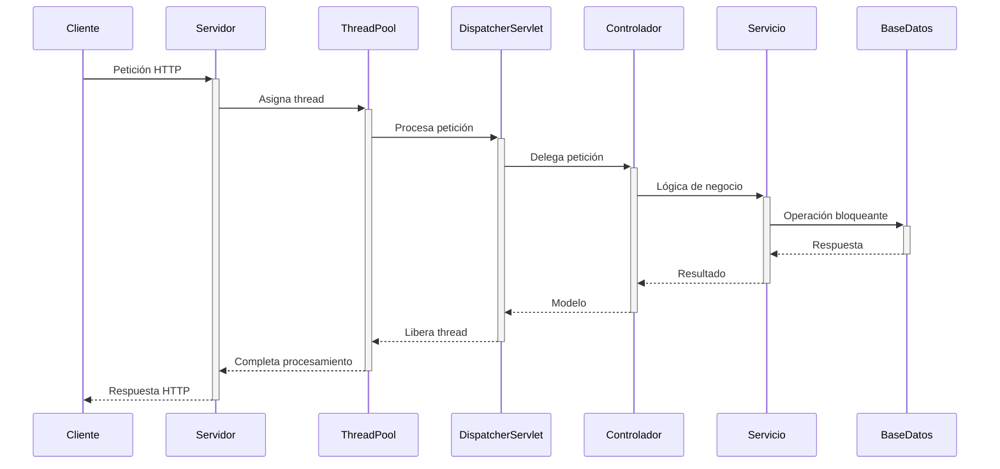
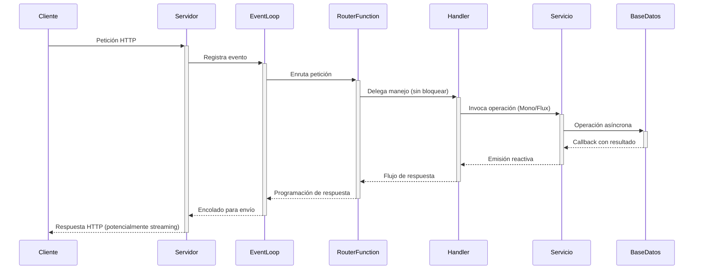
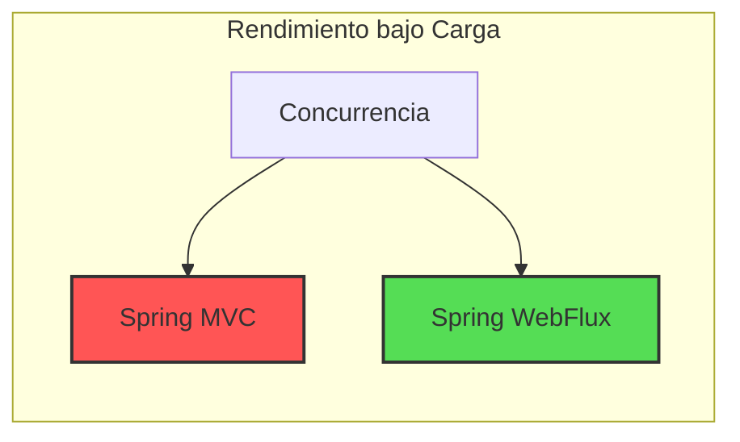

En el ecosistema de Spring, dos frameworks destacan para el desarrollo de aplicaciones web: **Spring MVC** y **Spring WebFlux**. Aunque ambos permiten construir aplicaciones web robustas, se basan en paradigmas fundamentalmente diferentes que impactan directamente en la arquitectura, el rendimiento y la escalabilidad de tus aplicaciones.

Esta guía te ayudará a entender en profundidad las diferencias entre ambos frameworks, para que puedas tomar una decisión informada al iniciar tu próximo proyecto Spring.

## 1. Fundamentos Arquitectónicos

### Spring MVC: ¡La vieja confiable!


Spring MVC se basa en el patrón Modelo-Vista-Controlador y opera sobre la **API de Servlets de Java**. Su arquitectura fundamental:

- **Bloqueante y síncrona**: Un thread maneja una petición desde el inicio hasta el final
- **Basado en Servlet API**: Funciona sobre servidores como Tomcat, Jetty o Undertow
- **Modelo mental simple**: Sigue el flujo de programación imperativa tradicional



### Spring WebFlux: ¡Concurrencia Masiva Bro!


Spring WebFlux se basa en el paradigma de **programación reactiva** y utiliza un modelo no bloqueante:

- **No bloqueante y asíncrono**: Los threads no esperan por operaciones de E/S
- **Basado en Reactive Streams**: Implementa la especificación Reactive Streams
- **Motor Netty**: Funciona sobre servidores como Netty (por defecto) o adaptadores de Servlet 3.1+
- **Backpressure integrado**: Control de flujo incorporado para gestionar la carga



## 2. Comparativa Técnica Detallada

|Aspecto|Spring MVC|Spring WebFlux|
|-------|----------|-------------|
|**Paradigma**|Imperativo/Síncrono|Reactivo/Asíncrono|
|**Modelo de Threads**|Thread-per-request|Event loop con pocos threads|
|**Manejo de E/S**|Bloqueante|No bloqueante|
|**Respuesta a Sobrecarga**|Agotamiento del pool de threads|Degradación progresiva|
|**Consumo de Memoria**|Mayor (1MB+ por thread)|Menor (memoria compartida entre peticiones)|
|**Throughput bajo presión**|Se degrada rápidamente al agotar threads|Se mantiene estable con alta concurrencia|
|**Tipo de Retorno**|Objetos simples|Mono<T> / Flux<T>|
|**Anotaciones**|@Controller, @RequestMapping, etc.|Iguales + RouterFunctions|
|**Soporte para Streaming**|Limited (Callable, DeferredResult)|Nativo (Server-Sent Events, WebSockets)|
|**Depuración**|Más sencilla (stack traces claros)|Más compleja (stack traces asíncronos)|
|**Latencia**|Puede ser menor para operaciones simples|Puede ser menor bajo alta carga|

## 3. Ejemplos Prácticos

### Ejemplo 1: Consulta Simple a Base de Datos

#### Spring MVC

```java
@RestController
@RequestMapping("/api/products")
public class ProductController {
    
    private final ProductRepository productRepository;
    
    public ProductController(ProductRepository productRepository) {
        this.productRepository = productRepository;
    }
    
    @GetMapping("/{id}")
    public ResponseEntity<Product> getProduct(@PathVariable Long id) {
        // Thread bloqueado mientras se realiza la consulta a BD
        return productRepository.findById(id)
                .map(ResponseEntity::ok)
                .orElse(ResponseEntity.notFound().build());
    }
    
    @GetMapping
    public ResponseEntity<List<Product>> getAllProducts() {
        // Thread bloqueado hasta que se recuperen todos los productos
        List<Product> products = productRepository.findAll();
        return ResponseEntity.ok(products);
    }
    
    @PostMapping
    public ResponseEntity<Product> createProduct(@RequestBody Product product) {
        // Thread bloqueado durante la operación de guardado
        Product savedProduct = productRepository.save(product);
        URI location = ServletUriComponentsBuilder
                .fromCurrentRequest()
                .path("/{id}")
                .buildAndExpand(savedProduct.getId())
                .toUri();
        return ResponseEntity.created(location).body(savedProduct);
    }
}
```

#### Spring WebFlux

```java
@RestController
@RequestMapping("/api/products")
public class ProductController {
    
    private final ReactiveProductRepository productRepository;
    
    public ProductController(ReactiveProductRepository productRepository) {
        this.productRepository = productRepository;
    }
    
    @GetMapping("/{id}")
    public Mono<ResponseEntity<Product>> getProduct(@PathVariable Long id) {
        // No hay bloqueo - se devuelve un Mono que se resolverá en el futuro
        return productRepository.findById(id)
                .map(ResponseEntity::ok)
                .defaultIfEmpty(ResponseEntity.notFound().build());
    }
    
    @GetMapping
    public Flux<Product> getAllProducts() {
        // Devuelve un flujo reactivo de productos
        return productRepository.findAll();
    }
    
    @PostMapping
    public Mono<ResponseEntity<Product>> createProduct(@RequestBody Product product) {
        return productRepository.save(product)
                .map(savedProduct -> {
                    URI location = UriComponentsBuilder
                            .fromCurrentRequest()
                            .path("/{id}")
                            .buildAndExpand(savedProduct.getId())
                            .toUri();
                    return ResponseEntity.created(location).body(savedProduct);
                });
    }
}
```

### Ejemplo 2: Integración con Servicios Externos

#### Spring MVC

```java
@Service
public class WeatherService {
    
    private final RestTemplate restTemplate;
    private final String apiKey;
    
    public WeatherService(RestTemplate restTemplate, @Value("${weather.api.key}") String apiKey) {
        this.restTemplate = restTemplate;
        this.apiKey = apiKey;
    }
    
    public WeatherData getWeatherForCity(String city) {
        // Bloqueo durante la llamada HTTP
        return restTemplate.getForObject(
                "https://api.weather.com/data?city={city}&key={key}",
                WeatherData.class,
                city, apiKey
        );
    }
    
    public List<WeatherData> getWeatherForMultipleCities(List<String> cities) {
        // Llamadas secuenciales bloqueantes - ineficiente
        return cities.stream()
                .map(this::getWeatherForCity)
                .collect(Collectors.toList());
    }
}

@RestController
@RequestMapping("/api/weather")
public class WeatherController {
    
    private final WeatherService weatherService;
    
    @GetMapping("/{city}")
    public ResponseEntity<WeatherData> getWeatherForCity(@PathVariable String city) {
        // El thread espera mientras se obtienen los datos
        WeatherData data = weatherService.getWeatherForCity(city);
        return ResponseEntity.ok(data);
    }
}
```

#### Spring WebFlux

```java
@Service
public class WeatherService {
    
    private final WebClient webClient;
    private final String apiKey;
    
    public WeatherService(WebClient.Builder webClientBuilder, @Value("${weather.api.key}") String apiKey) {
        this.webClient = webClientBuilder
                .baseUrl("https://api.weather.com")
                .build();
        this.apiKey = apiKey;
    }
    
    public Mono<WeatherData> getWeatherForCity(String city) {
        // Llamada HTTP no bloqueante
        return webClient.get()
                .uri(uriBuilder -> uriBuilder
                        .path("/data")
                        .queryParam("city", city)
                        .queryParam("key", apiKey)
                        .build())
                .retrieve()
                .bodyToMono(WeatherData.class);
    }
    
    public Flux<WeatherData> getWeatherForMultipleCities(List<String> cities) {
        // Procesamiento en paralelo de manera eficiente
        return Flux.fromIterable(cities)
                .flatMap(this::getWeatherForCity);
    }
}

@RestController
@RequestMapping("/api/weather")
public class WeatherController {
    
    private final WeatherService weatherService;
    
    @GetMapping("/{city}")
    public Mono<WeatherData> getWeatherForCity(@PathVariable String city) {
        // Retorna inmediatamente un Mono que se resolverá en el futuro
        return weatherService.getWeatherForCity(city);
    }
    
    @GetMapping(value = "/stream", produces = MediaType.TEXT_EVENT_STREAM_VALUE)
    public Flux<WeatherUpdate> streamWeatherUpdates() {
        // Streaming continuo de actualizaciones
        return weatherService.getWeatherUpdatesStream()
                .delayElements(Duration.ofSeconds(1)); // Una actualización cada segundo
    }
}
```

### Ejemplo 3: Manejo de Errores

#### Spring MVC

```java
@RestController
@RequestMapping("/api")
public class UserController {
    
    private final UserService userService;
    
    @GetMapping("/users/{id}")
    public ResponseEntity<User> getUser(@PathVariable Long id) {
        try {
            User user = userService.findById(id);
            return ResponseEntity.ok(user);
        } catch (UserNotFoundException e) {
            return ResponseEntity.notFound().build();
        } catch (Exception e) {
            return ResponseEntity.status(HttpStatus.INTERNAL_SERVER_ERROR).build();
        }
    }
    
    @ExceptionHandler(UserNotFoundException.class)
    public ResponseEntity<ErrorResponse> handleUserNotFound(UserNotFoundException ex) {
        ErrorResponse error = new ErrorResponse("USER_NOT_FOUND", ex.getMessage());
        return ResponseEntity.status(HttpStatus.NOT_FOUND).body(error);
    }
}
```

#### Spring WebFlux

```java
@RestController
@RequestMapping("/api")
public class UserController {
    
    private final UserService userService;
    
    @GetMapping("/users/{id}")
    public Mono<ResponseEntity<User>> getUser(@PathVariable Long id) {
        return userService.findById(id)
                .map(ResponseEntity::ok)
                .defaultIfEmpty(ResponseEntity.notFound().build())
                .onErrorResume(UserNotFoundException.class, e -> 
                    Mono.just(ResponseEntity.status(HttpStatus.NOT_FOUND)
                        .body(new User()))
                )
                .onErrorResume(e -> 
                    Mono.just(ResponseEntity.status(HttpStatus.INTERNAL_SERVER_ERROR)
                        .build())
                );
    }
}

// Alternativamente, usando controlador de excepciones global
@RestControllerAdvice
public class GlobalExceptionHandler {
    
    @ExceptionHandler(UserNotFoundException.class)
    public Mono<ResponseEntity<ErrorResponse>> handleUserNotFound(UserNotFoundException ex) {
        ErrorResponse error = new ErrorResponse("USER_NOT_FOUND", ex.getMessage());
        return Mono.just(ResponseEntity.status(HttpStatus.NOT_FOUND).body(error));
    }
}
```

## 4. Casos de Uso: ¿Cuándo Elegir Cada Uno?

### Elige Spring MVC cuando:

1. **Tienes aplicaciones CRUD simples** donde las operaciones de E/S son rápidas
2. **Necesitas un modelo de programación familiar** para equipos con experiencia en Java tradicional
3. **Trabajas con bibliotecas que dependen de operaciones bloqueantes** (JPA, JDBC tradicional)
4. **La simplicidad es más importante que el rendimiento** en condiciones de alta carga
5. **Deseas un menor tiempo de desarrollo** y una curva de aprendizaje más suave
6. **Realizas principalmente operaciones sincrónicas** donde el resultado es necesario inmediatamente

**Ejemplos de aplicaciones ideales para MVC:**
- Aplicaciones administrativas empresariales
- Sitios web de comercio electrónico de volumen moderado
- Aplicaciones CRUD internas
- Dashboards y paneles de administración
- APIs REST sencillas

### Elige Spring WebFlux cuando:

1. **Necesitas alta concurrencia** con un número limitado de recursos (hilos, memoria)
2. **Tienes operaciones de E/S intensivas** (llamadas a servicios externos lentos, consultas complejas)
3. **Quieres implementar streaming de datos** (SSE, WebSockets, respuestas de gran tamaño)
4. **Trabajas con microservicios** que necesitan manejar muchas conexiones simultáneas
5. **Utilizas bases de datos reactivas** (MongoDB reactivo, R2DBC, Cassandra reactiva)
6. **Desarrollas aplicaciones orientadas a eventos** o streaming de datos en tiempo real

**Ejemplos de aplicaciones ideales para WebFlux:**
- Canales de chat en tiempo real
- Dashboards con actualizaciones en vivo
- Procesamiento de streams de eventos de IoT
- APIs de alta concurrencia (>1000 conexiones simultáneas)
- Agregadores de datos de múltiples servicios externos
- Aplicaciones con operaciones asíncronas encadenadas

## 5. Consideraciones de Rendimiento

### Spring MVC

```
Threads: 200
Solicitudes concurrentes: 1000
Tiempo de respuesta medio (operación simple): 15ms
Tiempo de respuesta medio (llamada a servicio externo): 250ms
Memoria por thread: ~1MB
```

La principal limitación es el número de threads disponibles:
- Si todas las peticiones requieren operaciones bloqueantes de 250ms, solo se pueden procesar ~800 peticiones/segundo con 200 threads
- Si el número de peticiones concurrentes supera el número de threads disponibles, las solicitudes comienzan a encolarse, aumentando drásticamente la latencia

### Spring WebFlux

```
Threads: 8 (número de núcleos)
Solicitudes concurrentes: 1000+
Tiempo de respuesta medio (operación simple): 20ms
Tiempo de respuesta medio (llamada a servicio externo): 250ms
Memoria por petición: ~0.5KB
```

Al no bloquear threads durante las operaciones de E/S:
- Los mismos 8 threads pueden manejar miles de peticiones concurrentes
- La latencia permanece estable incluso con carga elevada, hasta llegar al límite de recursos del sistema

### Comparativa Gráfica: Throughput vs. Concurrencia



En concurrencia baja, ambos tienen rendimiento similar, pero a medida que aumenta la concurrencia:
- MVC muestra degradación rápida cuando se agotan los threads
- WebFlux mantiene un rendimiento estable hasta llegar a límites mucho más altos

## 6. Migración de MVC a WebFlux

Si estás considerando migrar de Spring MVC a WebFlux, hay varios pasos clave:

1. **Evalúa la compatibilidad de tus dependencias**
   - JPA no es reactivo, considera R2DBC
   - Reemplaza RestTemplate por WebClient
   - Verifica si todas tus dependencias tienen alternativas reactivas

2. **Migración progresiva**
   - Comienza con partes no críticas
   - Usa adaptadores para integrar código reactivo y bloqueante
   - Considera una arquitectura híbrida durante la transición

3. **Adaptadores comunes**

```java
// De bloqueante a reactivo
public Mono<Product> getProductReactive(Long id) {
    return Mono.fromCallable(() -> productService.getProduct(id))
            .subscribeOn(Schedulers.boundedElastic());
}

// De reactivo a bloqueante
public Product getProductBlocking(Long id) {
    return reactiveProductService.getProduct(id).block();
}
```

4. **Consideraciones de rendimiento**
   - Prueba el rendimiento antes y después
   - Usa herramientas como Reactor Netty Debug para identificar bloqueos accidentales
   - Monitorea el número de threads utilizados y la latencia

5. **Cambia la mentalidad**
   - Entrena al equipo en programación reactiva
   - Comprende backpressure y manejo de errores reactivo
   - Adopta patrones como "fail fast" y "circuit breaker"

## 7. Conclusión: Tomando la Decisión Correcta

El debate entre Spring MVC y WebFlux no se trata de determinar cuál es mejor en términos absolutos, sino de elegir la herramienta adecuada para tus necesidades específicas.

### Preguntas Clave para la Decisión

1. **¿Cuál es la naturaleza de tu aplicación?**
   - Si es CRUD simple con baja/media concurrencia: MVC
   - Si requiere alto throughput o streaming: WebFlux

2. **¿Cómo son tus operaciones de E/S?**
   - Rápidas y/o infrecuentes: MVC
   - Lentas y/o frecuentes: WebFlux

3. **¿Cuál es la experiencia de tu equipo?**
   - Familiaridad con programación tradicional: MVC
   - Apertura a nuevos paradigmas o experiencia reactiva: WebFlux

4. **¿Qué otras tecnologías necesitas integrar?**
   - Bibliotecas tradicionales (JPA): MVC
   - Bases de datos/clientes reactivos: WebFlux

### La Opción Híbrida

Spring permite combinar ambos enfoques:
- Usa WebFlux para APIs de alta concurrencia
- Mantén MVC para servicios administrativos internos
- Comparte código de dominio entre ambos

```java
// Configuración híbrida
@Configuration
public class WebConfig {
    @Bean
    public RouterFunction<ServerResponse> reactiveRoutes() {
        // Rutas WebFlux para APIs de alta concurrencia
        return route(GET("/api/data/stream"), this::handleStreamRequest)
              .andRoute(POST("/api/events"), this::handleEventsRequest);
    }
}

@Controller  // Controlador MVC para admin
@RequestMapping("/admin")
public class AdminController {
    @GetMapping("/dashboard")
    public String dashboard(Model model) {
        model.addAttribute("stats", adminService.getStats());
        return "dashboard";
    }
}
```

En definitiva, no hay una respuesta única para todos los casos. El mejor framework es aquel que se alinea con tus requisitos, el conocimiento de tu equipo y las características específicas de tu aplicación.

La buena noticia: independientemente de tu elección, el ecosistema Spring te ofrece herramientas maduras y robustas para construir aplicaciones de alta calidad.

## 8. Recursos Adicionales

Para profundizar en estos temas, te recomiendo:

- [Documentación oficial de Spring WebFlux](https://docs.spring.io/spring-framework/docs/current/reference/html/web-reactive.html)
- [Introduction to Reactive Programming](https://projectreactor.io/learn)
- [Reactor Debugging Guide](https://projectreactor.io/docs/core/release/reference/#debugging)
- [R2DBC - Base de datos relacional reactiva](https://r2dbc.io/)
- [Comparativa de rendimiento: WebFlux vs MVC](https://www.youtube.com/watch?v=zVNIZXf4BG8)
